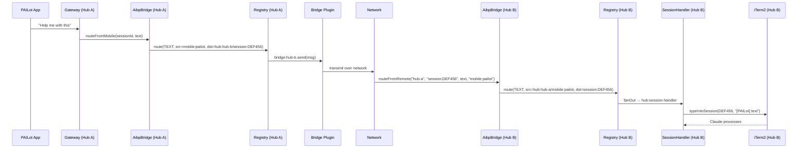

# Mesh Networking

Mesh networking enables message routing between multiple AIBroker hub instances running on separate machines. The primary use case is controlling Claude Code sessions on a remote Mac from a mobile device connected to a local hub.

## Architecture

```
┌─────────────────────┐          network          ┌─────────────────────┐
│   Hub A (local)     │ ◄──────────────────────── │   Hub B (remote)    │
│                     │          bridge             │                     │
│  mobile:pailot ─────┼──────────────────────────► │  session:UUID       │
│                     │                            │  hub:session-handler│
│  bridge:hub-b ──────┼──────────────────────────► │  (receives message) │
└─────────────────────┘                            └─────────────────────┘
```

A bridge plugin on Hub A holds the network connection to Hub B and forwards messages with mesh addresses.

## Mesh Addresses

Mesh addresses contain a `/` separator encoding the target hub and local destination:

```
hub:hub-b/session:DEF456
│          │
│          └─ local destination on the remote hub
└─ target hub identifier

hub:mac-mini/mobile:pailot
hub:work-laptop/session:ABC123
```

The `/` character is the distinguisher. `isLocal()` (from `src/aibp/envelope.ts`) returns `false` for any address containing `/`.

`parseMeshAddress()` splits the address:

```typescript
parseMeshAddress("hub:mac-mini/session:DEF456")
// → { hub: "hub:mac-mini", local: "session:DEF456" }
```

## Bridge Plugin

A bridge plugin is an AIBP plugin of type `"bridge"`. Its address is `bridge:<hubId>`.

```typescript
aibpBridge.registerBridge("hub-b", sendFn);
// Registers "bridge:hub-b" in the registry
```

The `sendFn` is responsible for delivering the message over the network to Hub B. The implementation depends on the transport (WebSocket, TCP socket, etc.) — AIBroker defines the protocol but not the physical transport.

### Registration

```typescript
interface PluginSpec {
  id: "hub-b";
  type: "bridge";
  name: "Bridge (hub-b)";
  capabilities: ["TEXT", "VOICE", "IMAGE", "COMMAND", "FILE"];
  channels: [];
}
```

Bridge plugins do not join channels. They receive messages only when the AIBP routing algorithm matches a mesh address.

## Routing to a Remote Hub

```
registry.route(msg)
    │
    ├─ dst contains "/"? → YES → routeToMesh()
    │                            │
    │                            ├─ Parse mesh address: hub=hub-b, local=session:DEF456
    │                            ├─ Look up bridge:hub-b in plugins
    │                            ├─ Found → bridge.send(msg)
    │                            └─ Not found → try any bridge plugin
    │                                          └─ None → log MESH FAIL
```

From `src/aibp/registry.ts`:

```typescript
private routeToMesh(msg: AibpMessage, hubAddress: string, localDst: string): void {
  const hubId = hubAddress.startsWith("hub:") ? hubAddress.slice(4) : hubAddress;

  // Prefer the bridge registered for this specific hub
  const specificBridge = this.plugins.get(`bridge:${hubId}`);
  if (specificBridge) {
    specificBridge.send(msg);
    return;
  }

  // Fallback: any bridge plugin
  for (const [, conn] of this.plugins) {
    if (conn.plugin.spec.type === "bridge") {
      conn.send(msg);
      return;
    }
  }
  log(`[AIBP] MESH FAIL: no bridge plugin for ${hubAddress}`);
}
```

### AibpBridge.routeToRemote()

Convenience method that constructs the mesh address and routes:

```typescript
bridge.routeToRemote(
  "hub-b",                  // target hub ID
  "session:DEF456",         // local destination on remote hub
  "Hello from Hub A",       // content
  localSessionId,           // src session (optional)
  "TEXT",                   // message type
);

// Creates message:
// src = "session:localId" (or "hub:local")
// dst = "hub:hub-b/session:DEF456"
// type = "TEXT"
```

## Receiving Messages from a Remote Hub

When Hub B receives the message over the network, it reconstructs it and routes locally using `routeFromRemote()`:

```typescript
// On Hub B, called by the bridge's network receive handler:
bridge.routeFromRemote(
  "hub-a",              // fromHubId (identifies the sender)
  "session:DEF456",     // localDst (the local target)
  "Hello from Hub A",   // content
  "mobile:pailot",      // remoteSrc (the original sender on Hub A)
  "TEXT",
);

// Creates message:
// src = "hub:hub-a/mobile:pailot"  (prefixed with remote hub ID)
// dst = "session:DEF456"
// type = "TEXT"
```

The `src` is prefixed with the remote hub identifier so local plugins on Hub B know the message came from Hub A. This is important for:
- Reply routing (sending back to the correct hub)
- Audit and logging
- Security filtering (future: trust levels per hub)

## Message Flow: PAILot on Hub A → Claude on Hub B



## Listing Peers

```typescript
bridge.listPeers();
// Returns all registered bridge plugin hub IDs
// Example: ["hub-b", "hub-mac-mini"]
```

```typescript
registry.getPluginByType("bridge");
// Returns all RegisteredPlugin entries with type === "bridge"
```

## Current Status

Mesh networking is implemented at the AIBP protocol layer (`bridge.ts`, `registry.ts`) and tested, but no production bridge transport implementation exists yet. To make mesh networking operational:

1. Implement the bridge `sendFn` (WebSocket or TCP client to remote hub)
2. Implement the receive handler on the remote hub (calls `routeFromRemote`)
3. Register bridges on both hubs with matching hub IDs
4. Exchange mesh addresses between hubs (via config or discovery)

The AIBP protocol is ready. The network transport is the missing piece.

## Design Rationale

The mesh design deliberately separates protocol from transport:

- **Protocol** (in AIBroker): address format, routing algorithm, message serialization
- **Transport** (in bridge implementation): WebSocket, TCP, SSH tunnel, etc.

This means the same AIBP messages that flow over Unix sockets locally can flow over any network transport with no changes to the routing layer. The bridge `sendFn` is the only transport-specific code.

The fallback behavior (any bridge plugin if the specific one is not found) allows a hub with a single uplink to route to multiple remote hubs through that uplink, which can then forward locally.
