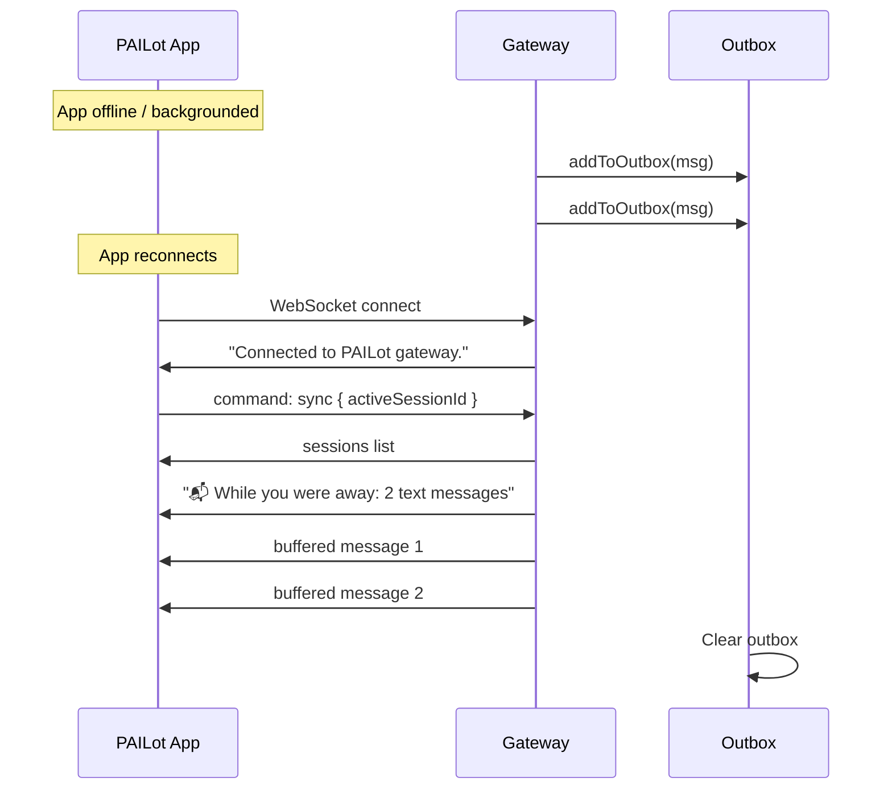

# PAILot Gateway

PAILot is a native iOS app that connects to the AIBroker hub via WebSocket. The gateway (`src/adapters/pailot/gateway.ts`) handles all PAILot connections on port 8765.

## Connection

```
PAILot iOS App ──────── WebSocket ──────── ws://[mac-ip]:8765
                           (ws)
```

Port is configurable via the `PAILOT_PORT` environment variable (default: `8765`).

Upon connection, the gateway immediately sends:

```json
{ "type": "text", "content": "Connected to PAILot gateway." }
```

The app then sends a `sync` command to establish session state and drain any buffered messages.

## Message Format

All WebSocket messages are JSON objects. Every message has a `type` field.

### Inbound (App → Gateway)

#### Heartbeat

```json
{ "type": "ping" }
```

Gateway replies with `{ "type": "pong" }`. Used to maintain liveness tracking.

#### Structured Commands

```json
{
  "type": "command",
  "command": "sync",
  "args": { "activeSessionId": "iTerm2-UUID-..." }
}
```

See [Structured Commands](#structured-commands) section for all command types.

#### Text Message

```json
{
  "type": "text",
  "content": "What's the build status?",
  "sessionId": "iTerm2-UUID-..."
}
```

The `sessionId` field tells the gateway which Claude Code session to route to. If provided and different from the current active session, the gateway switches the active session before routing.

#### Voice Message

```json
{
  "type": "voice",
  "audioBase64": "base64-encoded-M4A...",
  "messageId": "uuid-for-transcript-reflection",
  "sessionId": "iTerm2-UUID-..."
}
```

The gateway transcribes the audio with Whisper and routes the transcript. See [Voice Pipeline](#voice-pipeline).

#### Image Message

```json
{
  "type": "image",
  "imageBase64": "base64-encoded-JPEG...",
  "mimeType": "image/jpeg",
  "caption": "optional description",
  "sessionId": "iTerm2-UUID-..."
}
```

The image is saved to a temp file. Claude Code can then read it with the `Read` tool. The file path is included in the routed text message.

### Outbound (Gateway → App)

#### Text Reply

```json
{
  "type": "text",
  "content": "Here's the build status...",
  "sessionId": "iTerm2-UUID-..."
}
```

#### Voice Reply

```json
{
  "type": "voice",
  "content": "transcript text",
  "audioBase64": "base64-encoded-M4A...",
  "sessionId": "iTerm2-UUID-..."
}
```

Audio is OGG Opus from the Kokoro TTS pipeline, converted to M4A (AAC) before sending to iOS. iOS cannot play OGG natively.

#### Image / Screenshot

```json
{
  "type": "image",
  "imageBase64": "base64-encoded-PNG...",
  "caption": "Screenshot",
  "sessionId": "iTerm2-UUID-..."
}
```

#### Typing Indicator

```json
{
  "type": "typing",
  "typing": true,
  "sessionId": "iTerm2-UUID-..."
}
```

Sent when a message is received from the app (typing=true) and when the response is ready (typing=false). Not buffered in the outbox.

#### Session List

```json
{
  "type": "sessions",
  "sessions": [
    { "index": 1, "name": "My Project", "type": "claude", "kind": "visual", "isActive": true, "id": "UUID..." },
    { "index": 2, "name": "API Session", "type": "claude", "kind": "api", "isActive": false, "id": "UUID..." }
  ]
}
```

#### Transcript Reflection

```json
{
  "type": "transcript",
  "messageId": "uuid-from-original-voice-message",
  "content": "transcribed text"
}
```

Sent after Whisper transcription so the app can update the voice bubble to show the transcript text.

#### Projects List

```json
{
  "type": "projects",
  "projects": [
    { "name": "My Project", "slug": "my-project", "path": "/Users/me/project", "sessions": 2 }
  ]
}
```

#### Session Events

```json
{ "type": "session_switched", "name": "My Project", "sessionId": "UUID..." }
{ "type": "session_renamed", "sessionId": "UUID...", "name": "New Name" }
{ "type": "error", "message": "Session not found" }
```

#### Status

```json
{ "type": "status", "status": "compacting" }
```

## Structured Commands

Commands are structured API calls from the app. All commands are sent as `{ type: "command", command: "...", args: {} }`.

### `sync`

The primary connection handshake. Sent after connecting to establish session state.

```json
{
  "type": "command",
  "command": "sync",
  "args": { "activeSessionId": "iTerm2-UUID-..." }
}
```

The gateway:
1. Discovers all live Claude-related iTerm2 tabs
2. Prunes stale sessions from `HybridSessionManager`
3. Registers any newly discovered sessions
4. Restores the client's previously active session (if `activeSessionId` provided and still alive)
5. Falls back to the currently focused iTerm2 tab
6. Sends the updated sessions list
7. Drains the outbox

Session detection heuristics (a tab qualifies as "Claude-related" if any are true):
- Has a PAILot session variable (`paiName` set)
- Tab title contains "claude"
- Is not at the shell prompt (a process is running)

### `sessions`

Request the current session list.

```json
{ "type": "command", "command": "sessions" }
```

Response: `{ type: "sessions", sessions: [...] }`

### `switch`

Switch the active session. Accepts either `index` (1-based) or `sessionId` (iTerm2 UUID).

```json
{
  "type": "command",
  "command": "switch",
  "args": { "index": 2 }
}
```

```json
{
  "type": "command",
  "command": "switch",
  "args": { "sessionId": "UUID...", "name": "New Name" }
}
```

For visual sessions, the corresponding iTerm2 tab is brought to focus. The session is recorded in `pailotReplyMap` so outbound replies go to it regardless of which tab is later focused on the Mac.

Response: `{ type: "session_switched", name, sessionId }`

### `rename`

Rename a session.

```json
{
  "type": "command",
  "command": "rename",
  "args": { "sessionId": "UUID...", "name": "New Name" }
}
```

For visual sessions, updates the iTerm2 tab title and session variable.

Response: `{ type: "session_renamed", sessionId, name }` + updated sessions list.

### `remove`

Remove and close a session.

```json
{
  "type": "command",
  "command": "remove",
  "args": { "sessionId": "UUID..." }
}
```

For visual sessions, kills the iTerm2 tab. Response: updated sessions list.

### `create`

Create a new Claude session. Two modes:

**From a PAI project:**
```json
{
  "type": "command",
  "command": "create",
  "args": { "project": "my-project-slug" }
}
```

**At a custom path:**
```json
{
  "type": "command",
  "command": "create",
  "args": { "path": "/Users/me/project" }
}
```

Response: `{ type: "session_switched", name, sessionId }` + sessions list.

### `projects`

List PAI projects available for launch.

```json
{ "type": "command", "command": "projects" }
```

Response: `{ type: "projects", projects: [...] }`

### `screenshot`

Take a screenshot of the active iTerm2 window.

```json
{ "type": "command", "command": "screenshot" }
```

For API sessions: returns text status instead. For visual sessions: triggers a screenshot and broadcasts it via `broadcastImage()`.

### `nav`

Send a keyboard event to the active iTerm2 session.

```json
{
  "type": "command",
  "command": "nav",
  "args": { "key": "enter" }
}
```

Supported `key` values:

| Key | Action |
|-----|--------|
| `up` | ANSI cursor up (ESC[A) |
| `down` | ANSI cursor down (ESC[B) |
| `left` | ANSI cursor left (ESC[D) |
| `right` | ANSI cursor right (ESC[C) |
| `enter` | ASCII 13 (Return) |
| `tab` | ASCII 9 (Tab) |
| `escape` | ASCII 27 (Escape) |
| `ctrl-c` | ASCII 3 (ETX / Ctrl+C) |
| any other string | Typed as literal text (vi keys like "dd", "0", "G") |

After sending the key, the gateway waits 600ms and takes an auto-screenshot so the app sees the updated terminal state.

Nav commands are rejected for API sessions with: "Keyboard commands need a visual session."

## Voice Pipeline

```
PAILot App sends M4A audio (base64)
        │
        ▼
Save to temp file: /tmp/pailot-voice-{ts}-{uuid}.m4a
        │
        ▼
Whisper transcription:
  whisper [file.m4a] --model [model] --output_format txt --output_dir /tmp
        │ (up to 120s timeout)
        ▼
Read /tmp/pailot-voice-{ts}-{uuid}.txt
        │
        ▼
Broadcast { type: "transcript", messageId, content } to app
(so voice bubble shows transcribed text)
        │
        ▼
Voice batching (3-second window):
  - Multiple voice chunks accumulate in voiceBatchTranscripts[]
  - Timer resets on each new chunk
  - After 3s of silence, flush all transcripts as one message
        │
        ▼
Route combined transcript via AIBP:
  bridge.routeFromMobile(sessionId, "[PAILot:voice] combined transcript")
        │
        ▼
Cleanup temp files
```

The 3-second batch window handles voice dictation in multiple chunks (common on iOS when pausing between sentences).

Whisper binary location: `WHISPER_BIN` (from `src/adapters/kokoro/media.ts`)
Whisper model: `WHISPER_MODEL` (from `src/adapters/kokoro/media.ts`)

## Client Liveness Tracking

iOS can keep a WebSocket connection "open" while the app is backgrounded. `ws.send()` succeeds but the app never processes the data.

The gateway uses a liveness threshold to avoid sending to dead connections:

```typescript
const CLIENT_ALIVE_THRESHOLD = 90_000; // 90 seconds
```

A client is "alive" if:
- `ws.readyState === WebSocket.OPEN`
- Last activity (connect, message, or pong) was within 90s

The 30-second heartbeat ping from the app maintains liveness. Messages are only broadcast to alive clients.

## Outbox Buffering

When no alive clients are connected, messages are buffered in the per-session outbox.

### Limits

```typescript
const MAX_OUTBOX_PER_SESSION = 50; // messages per session
```

TYPING messages are never buffered. IMAGE messages increment `missedImageCount` but are not buffered (too large).

### Storage

Outbox entries are organized by session ID:

```typescript
const outboxMap = new Map<string, OutboxEntry[]>();
// "_global" is used as session key when sessionId is not available
```

Entries are persisted to disk at `~/.aibroker/outbox/pending.json` after every change. The file is restored at gateway startup to survive daemon restarts.

### Drain

Outbox is drained when:
1. A `sync` command is received from a newly connected client
2. The drain is triggered explicitly by `drainOutbox(ws)`

The drain sends a summary message first:

```json
{
  "type": "text",
  "content": "📬 While you were away: 3 text message(s), 1 voice note(s)"
}
```

Then all buffered messages are replayed in timestamp order across all sessions.



## Session Reply Routing

Outbound replies must go to the correct session even if the user has switched iTerm tabs on the Mac since sending their message.

The `pailotReplyMap` tracks which session each PAILot message came from:

```typescript
const pailotReplyMap = new Map<string, string>();
// iTerm session ID → iTerm session ID (currently identity, reserved for remapping)
```

`lastRoutedSessionId` (from `state.ts`) is the session that last received user input. `resolveSessionId()` uses this order of preference:

1. `pailotReplyMap.get(sessionId)` — explicit reply mapping
2. `sessionId` parameter itself
3. `lastRoutedSessionId` — last session that received PAILot input
4. `activeItermSessionId` — currently active iTerm2 session
5. `hybridManager.activeSession.backendSessionId` — hybrid manager's active session

This ensures Claude's reply goes to the same session the user was viewing when they sent the message.

## AIBP Integration

The gateway is the bridge between WebSocket clients and the AIBP routing fabric.

**Inbound (App → AIBP):**

```typescript
bridge.routeFromMobile(sessionId, text);
// Creates: AibpMessage TEXT src=mobile:pailot dst=session:UUID
```

**Outbound (AIBP → App):**

The PAILot plugin callback in `daemon/index.ts` receives AIBP messages and calls the broadcast functions:

```typescript
aibpBridge.registerMobile("pailot", (aibpMsg) => {
  switch (aibpMsg.type) {
    case "TEXT": broadcastText(content, sessionId); break;
    case "VOICE": broadcastVoice(audioBuffer, transcript, sessionId); break;
    case "IMAGE": broadcastImage(imageBuffer, caption, sessionId); break;
  }
});
```

## Debug Logging

Set `PAILOT_DEBUG=1` to enable verbose debug logging to `/tmp/pailot-ws-debug.log`. This logs:
- Every raw WebSocket message (truncated)
- Voice message receipt and base64 length
- Audio file save path and byte count
