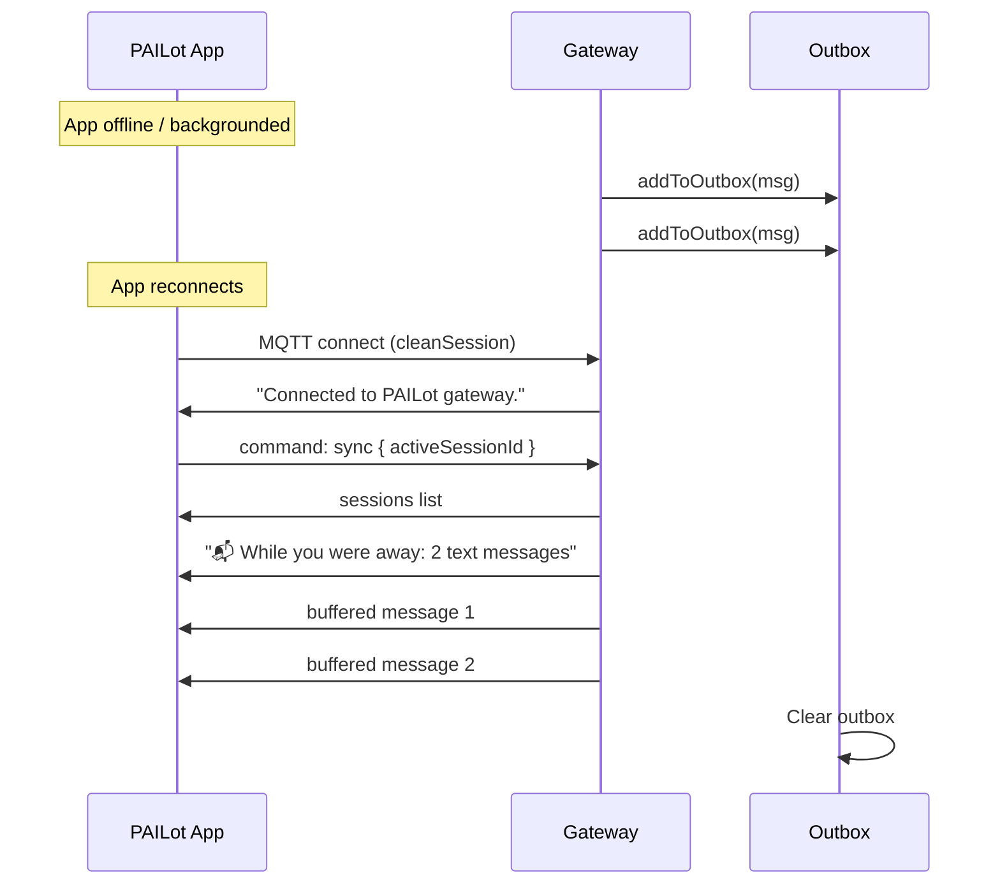

# PAILot Gateway

PAILot is a Flutter app (iOS and iPadOS) that reaches the AIBroker hub over
**MQTT**. The in-process broker is [aedes](https://github.com/moscajs/aedes),
started by the daemon and listening on port **8765**.

> **This replaced a WebSocket gateway.** `startWsGateway` still exists in
> `src/adapters/pailot/gateway.ts` and is deliberately **not called** — the call
> site is commented out in `src/daemon/index.ts`. Documentation written before
> the migration describes `ws://host:8765` and a socket per client; that is no
> longer how anything works. The gateway module survives because it still owns
> the broadcast/encode helpers (`broadcastText`, `broadcastVoice`,
> `broadcastImage`), which now publish to MQTT topics instead of sockets.

## Connection

```
PAILot (Flutter)  ──── MQTT ────  mqtt://<mac-ip>:8765
                                  mqtts:// when TLS credentials are configured
```

Port comes from `MQTT_PORT`, falling back to `PAILOT_PORT`, default `8765`. The
daemon also advertises itself over Bonjour as `_mqtt._tcp` under the name
`AIBroker`, so the app can find the Mac without a hardcoded address.

Clients connect with `cleanSession=true`. Nothing is retained on the broker for
an absent client — offline delivery is handled above the transport by the
message queue and `catch_up` (see [Offline delivery](#offline-delivery)), not by
MQTT persistence.

## Topics

| Topic | Direction | Carries |
|---|---|---|
| `pailot/out` | hub → app | text, voice, image, typing, screenshot, transcript |
| `pailot/status` | hub → app | daemon status and version |
| `pailot/sessions` | hub → app | the session list |
| `pailot/control/out` | hub → app | control replies (e.g. debug state) |
| `pailot/control/in` | app → hub | control requests |
| `pailot/device/token` | app → hub | the APNs device token |

Everything the app *says* — text, voice, commands — arrives on `pailot/control/in`
or as an inbound publish handled by `setMqttInboundHandler`; everything the hub
says goes out on `pailot/out` with the payload shapes documented below.

> **aedes 1.0.x caveat, and it bites.** `broker.publish()` does not deliver to
> MQTT protocol clients — only to in-process subscribers. The hub therefore
> publishes through a loopback client rather than the broker object. A change
> that "simplifies" this back to `broker.publish()` will look correct, log
> success, and deliver nothing.

## Push notifications

Delivery over MQTT reaches a connected app. A backgrounded or closed app is
reached by **APNs** (`src/apns/client.ts`), configured with `APNS_KEY_PATH`,
`APNS_KEY_ID`, `APNS_TEAM_ID`, and `APNS_PRODUCTION` to choose the production
host rather than sandbox. Device tokens arrive on `pailot/device/token` and are
stored in `~/.aibroker/apns-tokens.json`.

Two things worth knowing before debugging a "missing" notification:

- **iOS suppresses the banner while the app is in the foreground.** A push that
  logs `delivery: 2/2 succeeded` with the app open produces no banner and lands
  in the conversation instead. This is not a fault.
- **Sandbox and production tokens are not interchangeable.** A token minted by a
  development build is rejected by the production host with `BadDeviceToken`,
  and the client removes it on that error. Flipping `APNS_PRODUCTION` against
  the wrong build silently empties the token store.

## Message Format

All payloads are JSON objects with a `type` field. These shapes are unchanged from the WebSocket era — only the transport beneath them changed.

### Inbound (app → hub, on `pailot/control/in`)

#### Heartbeat

```json
{ "type": "ping" }
```

Gateway replies with `{ "type": "pong" }`. Used to maintain liveness tracking.

#### Structured Commands

```json
{
  "type": "command",
  "command": "sync",
  "args": { "activeSessionId": "iTerm2-UUID-..." }
}
```

See [Structured Commands](#structured-commands) section for all command types.

#### Text Message

```json
{
  "type": "text",
  "content": "What's the build status?",
  "sessionId": "iTerm2-UUID-..."
}
```

The `sessionId` field tells the gateway which Claude Code session to route to. If provided and different from the current active session, the gateway switches the active session before routing.

#### Voice Message

```json
{
  "type": "voice",
  "audioBase64": "base64-encoded-M4A...",
  "messageId": "uuid-for-transcript-reflection",
  "sessionId": "iTerm2-UUID-..."
}
```

The gateway transcribes the audio with Whisper and routes the transcript. See [Voice Pipeline](#voice-pipeline).

#### Image Message

```json
{
  "type": "image",
  "imageBase64": "base64-encoded-JPEG...",
  "mimeType": "image/jpeg",
  "caption": "optional description",
  "sessionId": "iTerm2-UUID-..."
}
```

The image is saved to a temp file. Claude Code can then read it with the `Read` tool. The file path is included in the routed text message.

### Outbound (Gateway → App)

#### Text Reply

```json
{
  "type": "text",
  "content": "Here's the build status...",
  "sessionId": "iTerm2-UUID-..."
}
```

#### Voice Reply

```json
{
  "type": "voice",
  "content": "transcript text",
  "audioBase64": "base64-encoded-M4A...",
  "sessionId": "iTerm2-UUID-..."
}
```

Audio is OGG Opus from the Kokoro TTS pipeline, converted to M4A (AAC) before sending to iOS. iOS cannot play OGG natively.

#### Image / Screenshot

```json
{
  "type": "image",
  "imageBase64": "base64-encoded-PNG...",
  "caption": "Screenshot",
  "sessionId": "iTerm2-UUID-..."
}
```

#### Typing Indicator

```json
{
  "type": "typing",
  "typing": true,
  "sessionId": "iTerm2-UUID-..."
}
```

Sent when a message is received from the app (typing=true) and when the response is ready (typing=false). Not buffered in the outbox.

#### Session List

```json
{
  "type": "sessions",
  "sessions": [
    { "index": 1, "name": "My Project", "type": "claude", "kind": "visual", "isActive": true, "id": "UUID..." },
    { "index": 2, "name": "API Session", "type": "claude", "kind": "api", "isActive": false, "id": "UUID..." }
  ]
}
```

#### Transcript Reflection

```json
{
  "type": "transcript",
  "messageId": "uuid-from-original-voice-message",
  "content": "transcribed text"
}
```

Sent after Whisper transcription so the app can update the voice bubble to show the transcript text.

#### Projects List

```json
{
  "type": "projects",
  "projects": [
    { "name": "My Project", "slug": "my-project", "path": "/Users/me/project", "sessions": 2 }
  ]
}
```

#### Session Events

```json
{ "type": "session_switched", "name": "My Project", "sessionId": "UUID..." }
{ "type": "session_renamed", "sessionId": "UUID...", "name": "New Name" }
{ "type": "error", "message": "Session not found" }
```

#### Status

```json
{ "type": "status", "status": "compacting" }
```

## Structured Commands

Commands are structured API calls from the app. All commands are sent as `{ type: "command", command: "...", args: {} }`.

### `sync`

The primary connection handshake. Sent after connecting to establish session state.

```json
{
  "type": "command",
  "command": "sync",
  "args": { "activeSessionId": "iTerm2-UUID-..." }
}
```

The gateway:
1. Discovers all live Claude-related iTerm2 tabs
2. Prunes stale sessions from `HybridSessionManager`
3. Registers any newly discovered sessions
4. Restores the client's previously active session (if `activeSessionId` provided and still alive)
5. Falls back to the currently focused iTerm2 tab
6. Sends the updated sessions list
7. Drains the outbox

Session detection heuristics (a tab qualifies as "Claude-related" if any are true):
- Has a PAILot session variable (`paiName` set)
- Tab title contains "claude"
- Is not at the shell prompt (a process is running)

### `sessions`

Request the current session list.

```json
{ "type": "command", "command": "sessions" }
```

Response: `{ type: "sessions", sessions: [...] }`

### `switch`

Switch the active session. Accepts either `index` (1-based) or `sessionId` (iTerm2 UUID).

```json
{
  "type": "command",
  "command": "switch",
  "args": { "index": 2 }
}
```

```json
{
  "type": "command",
  "command": "switch",
  "args": { "sessionId": "UUID...", "name": "New Name" }
}
```

For visual sessions, the corresponding iTerm2 tab is brought to focus. The session is recorded in `pailotReplyMap` so outbound replies go to it regardless of which tab is later focused on the Mac.

Response: `{ type: "session_switched", name, sessionId }`

### `rename`

Rename a session.

```json
{
  "type": "command",
  "command": "rename",
  "args": { "sessionId": "UUID...", "name": "New Name" }
}
```

For visual sessions, updates the iTerm2 tab title and session variable.

Response: `{ type: "session_renamed", sessionId, name }` + updated sessions list.

### `remove`

Remove and close a session.

```json
{
  "type": "command",
  "command": "remove",
  "args": { "sessionId": "UUID..." }
}
```

For visual sessions, kills the iTerm2 tab. Response: updated sessions list.

### `create`

Create a new Claude session. Two modes:

**From a PAI project:**
```json
{
  "type": "command",
  "command": "create",
  "args": { "project": "my-project-slug" }
}
```

**At a custom path:**
```json
{
  "type": "command",
  "command": "create",
  "args": { "path": "/Users/me/project" }
}
```

Response: `{ type: "session_switched", name, sessionId }` + sessions list.

### `projects`

List PAI projects available for launch.

```json
{ "type": "command", "command": "projects" }
```

Response: `{ type: "projects", projects: [...] }`

### `screenshot`

Take a screenshot of the active iTerm2 window.

```json
{ "type": "command", "command": "screenshot" }
```

For API sessions: returns text status instead. For visual sessions: triggers a screenshot and broadcasts it via `broadcastImage()`.

### `nav`

Send a keyboard event to the active iTerm2 session.

```json
{
  "type": "command",
  "command": "nav",
  "args": { "key": "enter" }
}
```

Supported `key` values:

| Key | Action |
|-----|--------|
| `up` | ANSI cursor up (ESC[A) |
| `down` | ANSI cursor down (ESC[B) |
| `left` | ANSI cursor left (ESC[D) |
| `right` | ANSI cursor right (ESC[C) |
| `enter` | ASCII 13 (Return) |
| `tab` | ASCII 9 (Tab) |
| `escape` | ASCII 27 (Escape) |
| `ctrl-c` | ASCII 3 (ETX / Ctrl+C) |
| any other string | Typed as literal text (vi keys like "dd", "0", "G") |

After sending the key, the gateway waits 600ms and takes an auto-screenshot so the app sees the updated terminal state.

Nav commands are rejected for API sessions with: "Keyboard commands need a visual session."

## Voice Pipeline

```
PAILot App sends M4A audio (base64)
        │
        ▼
Save to temp file: /tmp/pailot-voice-{ts}-{uuid}.m4a
        │
        ▼
Whisper transcription:
  whisper [file.m4a] --model [model] --output_format txt --output_dir /tmp
        │ (up to 120s timeout)
        ▼
Read /tmp/pailot-voice-{ts}-{uuid}.txt
        │
        ▼
Broadcast { type: "transcript", messageId, content } to app
(so voice bubble shows transcribed text)
        │
        ▼
Voice batching (3-second window):
  - Multiple voice chunks accumulate in voiceBatchTranscripts[]
  - Timer resets on each new chunk
  - After 3s of silence, flush all transcripts as one message
        │
        ▼
Route combined transcript via AIBP:
  bridge.routeFromMobile(sessionId, "[PAILot:voice] combined transcript")
        │
        ▼
Cleanup temp files
```

The 3-second batch window handles voice dictation in multiple chunks (common on iOS when pausing between sentences).

Whisper binary location: `WHISPER_BIN` (from `src/adapters/kokoro/media.ts`)
Whisper model: `WHISPER_MODEL` (from `src/adapters/kokoro/media.ts`)

## Client liveness

iOS suspends a backgrounded app's TCP socket without closing it, so the broker
can still count a client that will never process what it receives. Connection
state is a poor proxy for reachability: `getMqttClientCount()` reports what is
*attached*, not what is *awake*.

This matters mainly when reading logs. A push recorded alongside `clientCount=2`
reached two attached clients, at least one of which may have been asleep — which
is why APNs is a second path rather than a fallback, and why "the message was
sent" and "the person saw it" are different claims throughout this system.

## Outbox Buffering

When no alive clients are connected, messages are buffered in the per-session outbox.

### Limits

```typescript
const MAX_OUTBOX_PER_SESSION = 50; // messages per session
```

TYPING messages are never buffered. IMAGE messages increment `missedImageCount` but are not buffered (too large).

### Storage

Outbox entries are organized by session ID:

```typescript
const outboxMap = new Map<string, OutboxEntry[]>();
// "_global" is used as session key when sessionId is not available
```

Entries are persisted to disk at `~/.aibroker/outbox/pending.json` after every change. The file is restored at gateway startup to survive daemon restarts.

### Drain

Outbox is drained when:
1. A `sync` command is received from a newly connected client
2. The drain is triggered explicitly by `drainOutbox(ws)`

The drain sends a summary message first:

```json
{
  "type": "text",
  "content": "📬 While you were away: 3 text message(s), 1 voice note(s)"
}
```

Then all buffered messages are replayed in timestamp order across all sessions.


```mermaid
sequenceDiagram
    participant A as PAILot App
    participant G as Gateway
    participant O as Outbox

    Note over A: App offline / backgrounded

    G->>O: addToOutbox(msg)
    G->>O: addToOutbox(msg)

    Note over A: App reconnects

    A->>G: MQTT connect (cleanSession)
    G->>A: "Connected to PAILot gateway."
    A->>G: command: sync { activeSessionId }
    G->>A: sessions list
    G->>A: "📬 While you were away: 2 text messages"
    G->>A: buffered message 1
    G->>A: buffered message 2
    O->>O: Clear outbox
```

## Session Reply Routing

Outbound replies must go to the correct session even if the user has switched iTerm tabs on the Mac since sending their message.

The `pailotReplyMap` tracks which session each PAILot message came from:

```typescript
const pailotReplyMap = new Map<string, string>();
// iTerm session ID → iTerm session ID (currently identity, reserved for remapping)
```

`lastRoutedSessionId` (from `state.ts`) is the session that last received user input. `resolveSessionId()` uses this order of preference:

1. `pailotReplyMap.get(sessionId)` — explicit reply mapping
2. `sessionId` parameter itself
3. `lastRoutedSessionId` — last session that received PAILot input
4. `activeItermSessionId` — currently active iTerm2 session
5. `hybridManager.activeSession.backendSessionId` — hybrid manager's active session

This ensures Claude's reply goes to the same session the user was viewing when they sent the message.

## AIBP Integration

The gateway is the bridge between MQTT clients and the AIBP routing fabric.

**Inbound (App → AIBP):**

```typescript
bridge.routeFromMobile(sessionId, text);
// Creates: AibpMessage TEXT src=mobile:pailot dst=session:UUID
```

**Outbound (AIBP → App):**

The PAILot plugin callback in `daemon/index.ts` receives AIBP messages and calls the broadcast functions:

```typescript
aibpBridge.registerMobile("pailot", (aibpMsg) => {
  switch (aibpMsg.type) {
    case "TEXT": broadcastText(content, sessionId); break;
    case "VOICE": broadcastVoice(audioBuffer, transcript, sessionId); break;
    case "IMAGE": broadcastImage(imageBuffer, caption, sessionId); break;
  }
});
```

## Debug Logging

Set `PAILOT_DEBUG=1` to enable verbose debug logging to `/tmp/pailot-ws-debug.log (name is historical)`. This logs:
- Every raw inbound MQTT payload (truncated)
- Voice message receipt and base64 length
- Audio file save path and byte count
