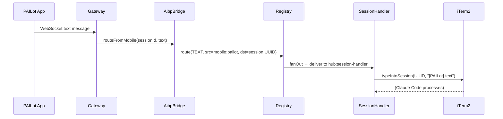
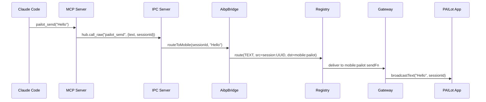
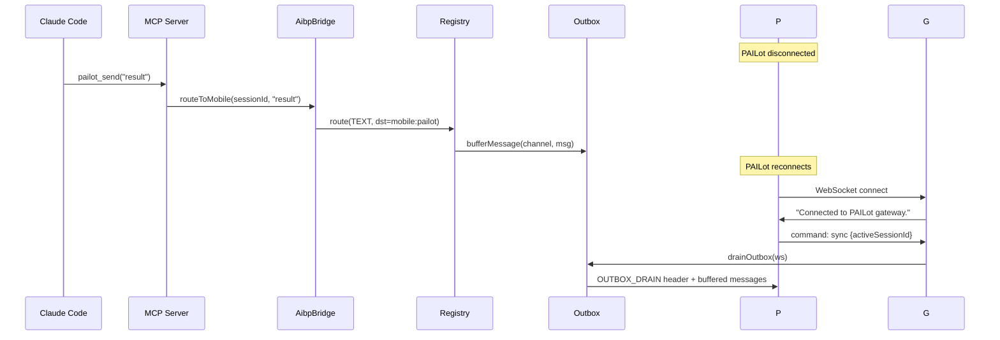

# Message Routing

Message routing is the core responsibility of the AIBP registry. Every message that enters the system is handed to `registry.route(msg)`. This document explains the full routing algorithm, how messages reach their destinations, and how buffering works for offline recipients.

## The Routing Algorithm

`registry.route(msg)` implements this priority-ordered decision tree:

```
route(msg)
    │
    ├─ Is dst a mesh address? (contains "/")
    │   └─ YES → routeToMesh() → deliver to bridge:hubId plugin
    │
    ├─ Is dst "hub:local"?
    │   └─ YES → handleHubMessage() → built-in commands or PING/PONG
    │
    ├─ Is dst a registered plugin address?
    │   └─ YES → send directly to that plugin's sendFn
    │
    ├─ Is dst a channel in the channel map?
    │   └─ YES → fanOut() → send to all members except sender
    │
    ├─ Does dst start with "session:"?
    │   └─ YES → auto-create channel + bufferMessage()
    │
    └─ No match → log routing failure, drop message
```

Source: `src/aibp/registry.ts`, `route()` method.

## Direct Delivery

The simplest case: `dst` is the address of a registered plugin.

```
sender                   registry                   recipient
  │                         │                           │
  │── route(msg, dst=X) ──► │                           │
  │                         │── plugins.get(X) ──►      │
  │                         │◄─ conn ──────────         │
  │                         │── conn.send(msg) ──────►  │
```

Direct delivery is used for:
- Hub → plugin delivery (commands, REGISTER_ACK)
- AIBP bridge convenience methods like `routeToMobile()` which sets `dst: "mobile:pailot"` directly

## Channel Fan-Out

When `dst` matches a channel name, the message is delivered to all channel members except the sender.

```typescript
private fanOut(msg: AibpMessage, membership: ChannelMembership): void {
  membership.lastMessageId = msg.id;
  membership.lastMessageTs = msg.ts;

  let delivered = 0;
  for (const member of membership.members) {
    if (member === msg.src) continue; // no echo
    const conn = this.plugins.get(member);
    if (conn) {
      conn.send(msg);
      delivered++;
    }
  }

  // Buffer if no online members received the message
  if (delivered === 0 && membership.members.size === 0) {
    this.bufferMessage(membership, msg);
  }
}
```

### Session Channels

Session channels (`session:UUID`) are the primary routing mechanism for messages to Claude Code sessions. A session channel typically has two members:

1. `hub:session-handler` — the hub's dispatch plugin that delivers to iTerm2 or an API session
2. `mobile:pailot` — joined when PAILot switches to that session

When PAILot sends a message, the flow is:

```
mobile:pailot → session:ABC123 → fan-out → hub:session-handler
                                          → (mobile:pailot excluded, it's the sender)
```

The session handler receives the message and dispatches it to the active Claude Code session.

### Auto-Creation

If a message targets `session:UUID` and no such channel exists yet, the registry auto-creates the channel and buffers the message:

```typescript
if (dst.startsWith("session:")) {
  const newMembership: ChannelMembership = {
    channel: dst,
    members: new Set(),
    outbox: [],
  };
  this.channels.set(dst, newMembership);
  this.bufferMessage(newMembership, msg);
  return;
}
```

This is important for startup sequencing: a message can arrive for a session before the session handler has joined that channel.

## Hub Command Routing

Messages to `hub:local` are handled by `handleHubMessage()`:

1. If `type: "COMMAND"`, look up the command in the command registry
   - If a plugin owns the command, deliver to that plugin
   - Otherwise, fall through to built-in hub commands (`list_channels`, `list_plugins`)
2. If `type: "SYSTEM"` and `event: "PING"`, respond with PONG and reset health counters

## Mesh Routing

Mesh addresses contain a `/` separating the target hub from the local destination on that hub:

```
hub:mac-mini/session:DEF456
│           │             │
│           │             └─ destination on remote hub
│           └─ separator
└─ target hub address
```

Routing to mesh:

```typescript
private routeToMesh(msg: AibpMessage, hubAddress: string, localDst: string): void {
  const hubId = hubAddress.startsWith("hub:") ? hubAddress.slice(4) : hubAddress;

  // Prefer the specific bridge for this hub
  const specificBridge = this.plugins.get(`bridge:${hubId}`);
  if (specificBridge) {
    specificBridge.send(msg);
    return;
  }

  // Fallback: any bridge plugin
  for (const [, conn] of this.plugins) {
    if (conn.plugin.spec.type === "bridge") {
      conn.send(msg);
      return;
    }
  }
  log(`[AIBP] MESH FAIL: no bridge plugin for ${hubAddress}`);
}
```

The bridge plugin's `sendFn` is responsible for delivering the message over the network to the remote hub. The remote hub's `routeFromRemote()` method reconstructs the message and routes it locally. See [mesh.md](./mesh.md) for details.

## Outbox Buffering

When a message cannot be delivered to any online member, it is buffered in the channel's outbox for later delivery. The outbox holds a maximum of 50 messages per channel (`MAX_OUTBOX = 50`). When the limit is exceeded, the oldest message is dropped.

### What Gets Buffered

```typescript
private bufferMessage(membership: ChannelMembership, msg: AibpMessage): void {
  // Typing indicators and system events are NOT buffered
  if (msg.type === "TYPING" || msg.type === "SYSTEM") return;

  if (membership.outbox.length >= MAX_OUTBOX) {
    membership.outbox.shift(); // Drop oldest
  }
  membership.outbox.push(msg);
}
```

TEXT, VOICE, IMAGE, COMMAND, STATUS, and FILE messages are all buffered. TYPING and SYSTEM are not.

### Outbox Drain

When a plugin joins a channel that has buffered messages, the outbox is drained immediately after join:

```typescript
join(address: string, channel: string): AibpMessage {
  // ... add member, update joinedChannels ...

  const buffered = membership.outbox.length;
  if (buffered > 0) {
    this.drainOutbox(address, channel);
  }

  return JOIN_ACK with unreadCount: buffered;
}
```

The drain sends an `OUTBOX_DRAIN` system event first (so the client knows messages are coming), then delivers all buffered messages in order:

```typescript
private drainOutbox(address: string, channel: string): void {
  // Send OUTBOX_DRAIN header
  conn.send(envelope.system("hub:local", address, "OUTBOX_DRAIN", {
    channel,
    count,
    summary: `${count} message(s) while offline`,
  }));

  // Deliver buffered messages
  for (const msg of membership.outbox) {
    conn.send(msg);
  }

  membership.outbox = []; // Clear after drain
}
```

## Cross-Session Messaging

The `aibp_send` IPC handler and `AibpBridge.routeBetweenSessions()` enable session A to send a message to session B:

```typescript
// From the IPC handler:
bridge.routeBetweenSessions(fromSessionId, toSessionId, content, "TEXT");

// Implementation:
const src = `session:${fromSessionId}`;
const dst = `session:${toSessionId}`;

// Ensure hub session handler is joined to the target session
this.ensureSessionJoin(toSessionId);

const message = msg.text(src, dst, content);
this.registry.route(message);
```

The `ensureSessionJoin()` call guarantees the hub's session handler has joined the target channel so it can deliver the message to the actual Claude Code session.

## Typing Indicators

Typing indicators are not buffered and are not routed through channels. They are sent directly:

```typescript
sendTyping(sessionId: string, active: boolean): void {
  const src = sessionId ? `session:${sessionId}` : "hub:local";
  this.registry.route(msg.typing(src, "mobile:pailot", active));
}
```

The `mobile:pailot` plugin receives typing indicators and the PAILot gateway broadcasts them to connected clients. Because TYPING messages are excluded from buffering, they can be freely sent without affecting the message queue.

## Routing Sequence Diagrams

### PAILot Text Message to Claude



### Claude Sends Reply via MCP



### Offline Client (Outbox Flow)


