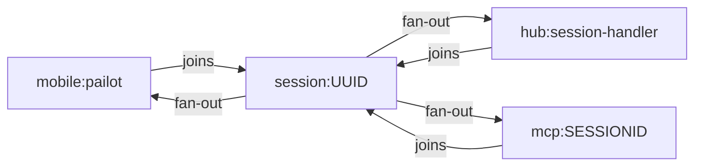
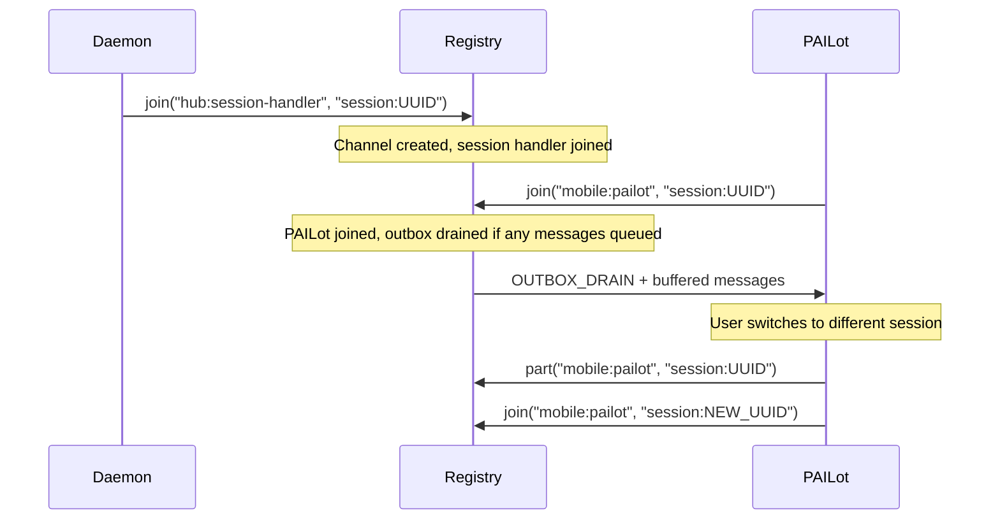
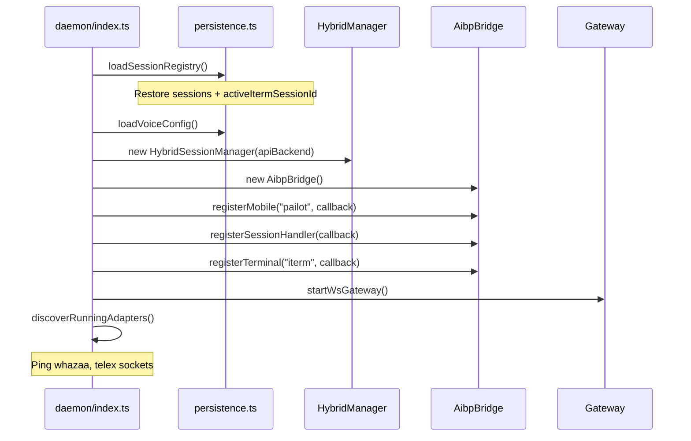

# Session Management

Sessions are the central concept for routing messages to the right Claude Code instance. AIBroker tracks two fundamentally different session kinds — headless API processes and visible iTerm2 terminal tabs — through a unified manager that presents them as a flat numbered list.

## Session Kinds

```typescript
type SessionKind = "api" | "visual";
```

| Kind | Backend | How Claude runs | Delivery method |
|------|---------|-----------------|-----------------|
| `api` | `APIBackend` | Headless subprocess via Claude Agent SDK | Direct SDK call |
| `visual` | iTerm2 | Claude Code in a terminal tab | AppleScript keystroke injection |

Both kinds appear in the same numbered list (1, 2, 3...) and respond to the same switch commands (`/s 2`, `/N 2`). The transport never needs to know which kind is active — message delivery logic is inside the daemon.

## HybridSession

Every session has this shape (`src/core/hybrid.ts`):

```typescript
interface HybridSession {
  id: string;               // "h-1", "h-2", ... (monotonic, never reused)
  name: string;             // Human-readable name
  cwd: string;              // Working directory
  kind: SessionKind;        // "api" or "visual"
  createdAt: number;        // Unix timestamp in ms
  backendSessionId: string; // "api-N" for API sessions, iTerm2 UUID for visual
}
```

The `backendSessionId` is the foreign key into the backend's own tracking system:
- For `api` sessions: `"api-1"`, `"api-2"`, etc. (assigned by `APIBackend`)
- For `visual` sessions: a UUID v4 string (the iTerm2 session ID from AppleScript)

## HybridSessionManager

Source: `src/core/hybrid.ts`

The manager keeps sessions in a creation-ordered array. The active session is tracked by array index, not by ID, so index numbers are stable within a session but reset on restart.

### Creating Sessions

```typescript
// Create a headless API session
const session = manager.createApiSession("My Project", "/Users/me/project");
// → HybridSession { id: "h-1", kind: "api", backendSessionId: "api-1" }

// Register a visual iTerm2 session
const session = manager.registerVisualSession("Claude Tab", "/Users/me/project", itermUUID);
// → HybridSession { id: "h-2", kind: "visual", backendSessionId: "ABC123-..." }
```

Both methods append to the sessions array and set the new session as active. For API sessions, `APIBackend.activeSessionId` is updated in sync.

### Switching Sessions

```typescript
// Switch to session 2 (1-based index)
const switched = manager.switchToIndex(2);
// Returns undefined if index is out of range
```

On switch to an API session, the `APIBackend.activeSessionId` pointer is updated immediately so the next message goes to the correct subprocess.

### Removing Sessions

```typescript
const removed = manager.removeByIndex(1); // 1-based
```

For API sessions, `APIBackend.endSession()` is called to terminate the subprocess. The active index is adjusted: if the removed session was active, the manager picks the previous session (or the first, if at index 0).

### Pruning Dead Visual Sessions

Visual sessions can disappear if the user closes an iTerm2 tab without going through AIBroker:

```typescript
// Called with the current set of live iTerm2 session IDs
const pruned = manager.pruneDeadVisualSessions(liveIds: Set<string>);
```

This walks the sessions list in reverse, removing any visual session whose `backendSessionId` is not in `liveIds`. This is called when rediscovering sessions to clean up stale entries.

### Formatting

```typescript
manager.formatSessionList();
// Returns:
// " 1. My Project [api] (/Users/me/project)"
// "*2. Claude Tab [visual] (/Users/me/project)"   ← active

manager.formatActiveStatus();
// For api sessions: text status from APIBackend.formatStatus()
// For visual sessions: null (signals transport to take a screenshot)
```

The `null` return from `formatActiveStatus()` for visual sessions is intentional. The transport interprets `null` as "take a screenshot" and sends the captured image instead of text.

## Session Discovery

Visual sessions are discovered at startup through iTerm2's AppleScript interface.

### iTerm2 Session ID

Each iTerm2 tab has a persistent UUID-format session ID, accessible via:

```applescript
tell application "iTerm2"
  tell current session of current tab of current window
    id -- returns UUID string
  end tell
end tell
```

The daemon stores this UUID as the `backendSessionId` for visual sessions and uses it as the AIBP session channel name (`session:UUID`).

### Auto-Discovery at Startup

```
daemon starts
    │
    ├─ loadSessionRegistry() — restore previous sessions from ~/.aibroker/sessions.json
    │   └─ For each entry: reconstruct sessionRegistry map + clientQueues
    │
    └─ discoverRunningAdapters() — ping known adapter sockets
        └─ whazaa, telex — registered if socket responds within 3s
```

The IPC server auto-registers unknown sessions when it receives a request with a `sessionId` it hasn't seen before:

```typescript
// src/ipc/server.ts — in request handler:
if (req.sessionId && !sessionRegistry.has(req.sessionId)) {
  sessionRegistry.set(req.sessionId, {
    sessionId: req.sessionId,
    name: "Session " + shortId,
    itermSessionId: req.itermSessionId,
    registeredAt: Date.now(),
  });
}
```

This means MCP clients self-register just by making their first IPC call.

## Session Persistence

Session data is persisted in `~/.aibroker/sessions.json`:

```json
{
  "activeItermSessionId": "ABC123-DEF456-...",
  "sessions": [
    {
      "sessionId": "iterm-uuid-of-mcp-client",
      "name": "Project A",
      "itermSessionId": "ABC123-..."
    }
  ]
}
```

### Format Evolution

The loader handles both the old array format (pre-v0.5) and the current object format:

```typescript
// Both are valid:
// Old: [{ sessionId, name, itermSessionId }]
// New: { activeItermSessionId, sessions: [...] }
const raw = Array.isArray(parsed) ? parsed : (parsed.sessions ?? []);
```

The `activeItermSessionId` field is used to restore the active session across daemon restarts.

### Save Triggers

`saveSessionRegistry()` is called after:
- Adapter registration (`register_adapter` IPC handler)
- Session name changes (`rename` IPC handler)
- Session switches (`switch` IPC handler)
- Session termination (`end_session` IPC handler)

## APIBackend Sessions

Source: `src/backend/api.ts`

API sessions run Claude as a subprocess. Each session has independent state:

```typescript
interface APISession {
  id: string;              // "api-1", "api-2", ...
  name: string;
  cwd: string;
  claudeSessionId?: string; // Claude Agent SDK UUID (set after first message, used for resume)
  lastActive: number;
}
```

### Session State Machine

```
APISession states (via SessionStatus.state):

  idle       ──── message received ────► thinking
  thinking   ──── tool call ────────────► tool_running
  tool_running ── tool done ────────────► thinking
  thinking   ──── response complete ───► done
  done       ──── cleared ───────────── idle (new conversation)
  any        ──── error ─────────────── error
  any        ──── compaction fires ───── compacting → thinking
```

The `currentTool` and `toolElapsed` fields on `SessionStatus` are updated in real time so `/ss` can show "Running Bash (12s)" during long operations.

### Resume Across Sessions

The `claudeSessionId` is the Claude Agent SDK's internal UUID for a conversation. Once set after the first message in a new API session, it is used to resume the same conversation context on subsequent messages. This survives daemon restarts as long as the session registry is saved and restored.

## AIBP Session Channels

Every visual session has a corresponding AIBP session channel (`session:UUID`) where UUID is the iTerm2 session ID. This channel connects:

1. `hub:session-handler` — receives inbound messages and dispatches to the Claude Code session
2. `mobile:pailot` — joined when PAILot is connected and viewing that session
3. `mcp:SESSIONID` — the MCP server process running in that session (if registered)



When PAILot switches to session 2, it:
1. Parts the previous session channel
2. Joins the new session channel
3. Receives any buffered messages from the outbox

This is handled by `AibpBridge.joinSession(itermSessionId)` and `AibpBridge.partSession(itermSessionId)`.

### Session Channel Lifecycle



## MCP Session Identity

The MCP server (`src/mcp/index.ts`) must identify which iTerm2 session it is running in. It does this at startup using a two-step detection:

```typescript
async function detectSessionId(): Promise<string | undefined> {
  // Step 1: Check environment variable (set by iTerm2 automatically)
  if (process.env.ITERM_SESSION_ID) {
    return process.env.ITERM_SESSION_ID;
  }

  // Step 2: Walk from current TTY to iTerm2 session via AppleScript
  const ttySessionId = await findSessionByTty();
  return ttySessionId;
}
```

Once detected, the session ID is used to:
1. Register the MCP process in AIBP (`registerMcp(pluginId, sessionEnvId)`)
2. Join the session channel so it receives messages
3. Include `sessionId` in every IPC request so the daemon can route responses

### Why ITERM_SESSION_ID

iTerm2 sets `ITERM_SESSION_ID` in every shell started in a new tab. Child processes inherit it. The MCP server — started by Claude Code's `mcp` configuration — inherits the variable from the Claude Code process, which inherited it from the shell.

## Status Cache

Source: `src/core/status-cache.ts`

The `StatusCache` is a daemon-resident, in-memory store of AI-parsed session summaries. It enables session orchestration: one Claude Code session can read the status of other sessions without terminal access.

### StatusSnapshot

```typescript
interface StatusSnapshot {
  sessionId: string;
  sessionName: string;
  timestamp: number;           // When snapshot was created
  state: "idle" | "busy" | "error" | "disconnected";
  summary: string;             // AI-parsed 1-2 sentence description
  contentHash: string;         // MD5 of raw terminal content at parse time
  lastProbeAt: number;         // When terminal content was last read
}
```

### Content Hashing

```typescript
function hashContent(content: string): string {
  return createHash("md5").update(content).digest("hex");
}
```

The hash is used for change detection. If the content hash matches the cached `contentHash`, the summary is still valid — no re-parsing needed:

```typescript
cache.hasChanged(sessionId, currentHash);
// Returns true if hash differs or no cache entry exists
```

### Cache Operations

```typescript
const cache = statusCache; // Singleton

// Store a parsed summary
cache.set(sessionId, snapshot);

// Retrieve
const snap = cache.get(sessionId);

// Get all snapshots (for /status command)
const all = cache.getAll();

// Update probe timestamp without invalidating summary
cache.touch(sessionId);

// Remove
cache.delete(sessionId);
```

### Session Orchestration Workflow

The cache is the backbone of cross-session coordination:

```
Session A (orchestrator)          StatusCache              Session B (worker)
        │                             │                         │
        │─ aibroker_session_content ──────────────────────────►│
        │   (reads Session B's terminal)                       │
        │◄─ raw terminal content ─────────────────────────────  │
        │                             │                         │
        │ (AI in Session A parses it)  │                        │
        │─ set snapshot ─────────────►│                         │
        │                             │                         │
        │ Later: another session asks  │                        │
        │─ aibroker_cache_status ─────►│                        │
        │◄─ all snapshots ────────────│                         │
```

The key design decision: the daemon stores only the raw data (content + hash). The requesting session's AI does the interpretation and calls back to store the parsed summary. This keeps the daemon stateless with respect to AI interpretation.

### MCP Tools for Cache

| Tool | Description |
|------|-------------|
| `aibroker_session_content` | Read raw terminal output for a session (by ID or index) |
| `aibroker_cache_status` | Store a parsed `StatusSnapshot` for a session |
| `aibroker_get_cached_status` | Retrieve cached snapshot(s) — one or all sessions |

## Session Naming

Sessions get names from several sources:

1. **Creation**: The name passed to `createApiSession()` or `registerVisualSession()`
2. **User command**: `/N [name]` renames the active session (`updateName()`)
3. **Name sync**: When the daemon discovers an iTerm2 tab, it can sync the tab's title as the session name
4. **MCP registration**: The MCP server sends `name` in its registration payload

Names are persisted in `sessions.json` and restored at startup.

## Startup Sequence



The session handler is registered in AIBP before the gateway starts, ensuring no messages are dropped during the startup window.
