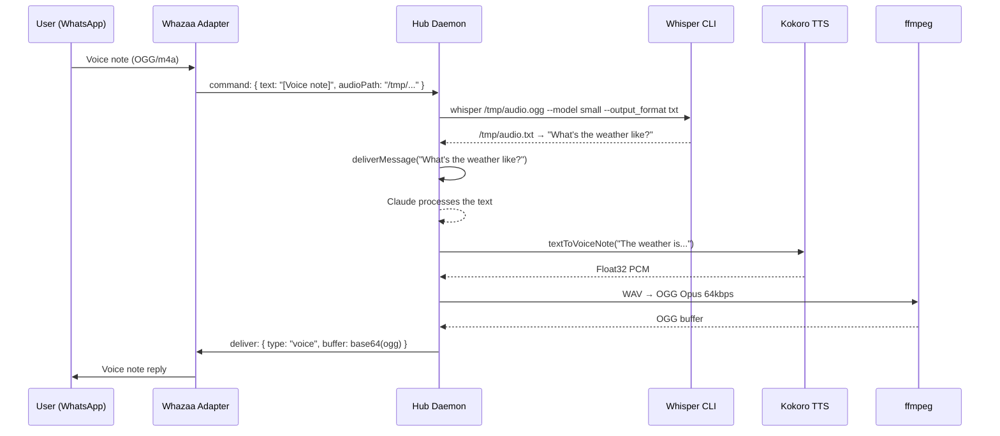

# TTS and STT

AIBroker ships two local speech systems: Kokoro TTS for synthesis and Whisper for transcription. Neither requires a network connection or API key. All processing runs on the local Mac.

## Kokoro TTS

Source: `src/adapters/kokoro/tts.ts`

Kokoro is an ONNX-based neural TTS model running via the `kokoro-js` npm package. The model file (`onnx-community/Kokoro-82M-v1.0-ONNX`) is downloaded on first use and cached locally by the Hugging Face transformers cache.

### Pipeline

```
text
  │
  ▼
KokoroTTS.generate(text, { voice })  — ONNX inference on CPU
  │
  ▼
Float32Array (PCM samples, 24,000 Hz)
  │
  ▼
float32ToWav()  — WAV file in /tmp (44-byte header + PCM)
  │
  ▼
ffmpeg -c:a libopus -b:a 64k -ar 24000 -ac 1 -application voip -vbr off
  │
  ▼
OGG Opus buffer  — sent as voice note to WhatsApp/Telegram/PAILot
```

For local playback (`aibroker_speak`), the WAV is handed directly to `afplay` (macOS only). The temp files are cleaned up after each generation.

### Model Details

| Setting | Value |
|---------|-------|
| Model | `onnx-community/Kokoro-82M-v1.0-ONNX` |
| Quantization | `q8` (8-bit integer) |
| Device | CPU |
| Sample rate | 24,000 Hz |
| Output format | OGG Opus, 64 kbps, mono |
| ffmpeg codec | `libopus`, VBR off, voip application |

The model is initialized lazily on the first TTS call. Subsequent calls reuse the loaded instance.

### Voice Resolution

Voice names are resolved flexibly — an exact match is tried first, then a suffix match (e.g. `"fable"` → `"bm_fable"`). Unknown voices fall back to the default. The default voice is:

1. `AIBROKER_TTS_VOICE` environment variable (preferred)
2. `MSGBRIDGE_TTS_VOICE` environment variable (legacy)
3. `WHAZAA_TTS_VOICE` environment variable (legacy)
4. `"bm_fable"` (hardcoded fallback)

### Voice List

28 voices across American female (`af_*`), American male (`am_*`), British female (`bf_*`), and British male (`bm_*`) accents:

| Prefix | Gender | Accent | Voices |
|--------|--------|--------|--------|
| `af_` | Female | American | `heart`, `alloy`, `aoede`, `bella`, `jessica`, `kore`, `nicole`, `nova`, `river`, `sarah`, `sky` |
| `am_` | Male | American | `adam`, `echo`, `eric`, `fenrir`, `liam`, `michael`, `onyx`, `puck`, `santa` |
| `bf_` | Female | British | `alice`, `emma`, `isabella`, `lily` |
| `bm_` | Male | British | `daniel`, `fable`, `george`, `lewis` |

Default personas (from voice config):

| Persona | Voice |
|---------|-------|
| Nicole | `af_nicole` |
| George | `bm_george` |
| Daniel | `bm_daniel` |
| Fable | `bm_fable` |

### Text Chunking

Source: `src/adapters/kokoro/media.ts` — `splitIntoChunks(text, maxChars=500)`

Long texts are split into chunks before TTS synthesis. Chunks are delivered as sequential voice notes with a 1-second delay between them. The splitting algorithm:

1. Split at paragraph breaks (`\n\n+`) first
2. If paragraphs are still too long, split at sentence boundaries (`[.!?]+`)
3. If sentences are still too long, split at commas
4. Final fallback: split at word boundaries

No chunk exceeds `maxChars` (500) characters.

### API

```typescript
// Convert text to OGG Opus buffer for sending as voice note
textToVoiceNote(text: string, voice?: string): Promise<Buffer>

// Speak locally through Mac speakers (afplay) — no network send
speakLocally(text: string, voice?: string): Promise<void>

// Return the full list of known voice IDs
listVoices(): string[]
```

### Text Pre-Processing

Before TTS, markdown formatting is stripped via `stripMarkdown()` (from `src/core/markdown.ts`). This prevents asterisks and pound signs from being read aloud.

### Dependencies

```
kokoro-js          — ONNX inference + voice synthesis
ffmpeg             — WAV → OGG Opus conversion
afplay             — macOS-only local audio playback (built-in)
```

ffmpeg is detected at these paths in priority order:
1. `/opt/homebrew/bin/ffmpeg` (Apple Silicon Homebrew)
2. `/usr/local/bin/ffmpeg` (Intel Homebrew)
3. `ffmpeg` (bare PATH lookup)

## PAILot Audio Delivery

When sending voice notes to the PAILot iOS app, there is an extra conversion step. iOS cannot play OGG natively:

```
OGG Opus buffer
      │
      ▼
ffmpeg -c:a aac -b:a 128k  →  M4A (AAC) buffer
      │
      ▼
base64-encoded M4A in WebSocket JSON
```

The conversion happens inside the PAILot gateway before sending. See [pailot.md](./pailot.md) for the full outbound message format.

## Whisper STT

Source: `src/adapters/kokoro/media.ts`

Whisper is used for speech-to-text transcription. AIBroker calls the `whisper` CLI binary rather than using the Python library directly.

### Pipeline

```
audio file (M4A, WAV, OGG, MP3, etc.)
        │
        ▼
whisper [file] --model [model] --output_format txt --output_dir /tmp --verbose False
        │ (timeout: 120 seconds)
        ▼
Read /tmp/[basename].txt
        │
        ▼
"[Label]: transcribed text"
```

Whisper is called with `execFile` (not shell interpolation) for safety. The environment PATH is augmented with `/opt/homebrew/bin:/usr/local/bin` so the binary is found regardless of which shell started the daemon.

### Configuration

| Variable | Default | Description |
|----------|---------|-------------|
| `AIBROKER_WHISPER_MODEL` | — | Model override (preferred) |
| `MSGBRIDGE_WHISPER_MODEL` | — | Legacy override |
| `WHAZAA_WHISPER_MODEL` | — | Legacy override |
| _(none set)_ | `"small"` | Default model |

Whisper binary detection paths (in order):
1. `/opt/homebrew/bin/whisper` (Apple Silicon Homebrew)
2. `/usr/local/bin/whisper` (Intel Homebrew)
3. `whisper` (bare PATH lookup)

### API

```typescript
transcribeAudio(
  audioPath: string,
  label?: string        // Label prefix, default "[Audio]"
): Promise<string | null>
```

Returns `"[Label]: transcript text"` or `null` on failure. Temp files (`.txt`, `.json`, `.vtt`, `.srt`, `.tsv`) are cleaned up in the `finally` block.

### PAILot Voice Flow

PAILot sends voice messages as base64 M4A. The gateway:

1. Saves the audio to `/tmp/pailot-voice-{ts}-{uuid}.m4a`
2. Calls `transcribeAudio(path, "[PAILot:voice]")`
3. Broadcasts a `transcript` WebSocket message back to the app (voice bubble update)
4. Buffers transcripts in a 3-second window (`BATCH_WINDOW_MS=3000`)
5. After 3 seconds of silence, combines all buffered transcripts and routes via AIBP
6. Cleans up temp files

The 3-second window handles iOS voice dictation patterns where users pause between sentences.

## Voice Configuration

Source: `src/core/persistence.ts`

Voice config persists to `~/.aibroker/voice-config.json`.

```typescript
interface VoiceConfig {
  defaultVoice: string;   // Default TTS voice ID
  voiceMode: boolean;     // Reply with voice notes by default
  localMode: boolean;     // Also play locally through Mac speakers
  personas: Record<string, string>;  // Persona name → voice ID
}
```

Default configuration:

```json
{
  "defaultVoice": "bm_fable",
  "voiceMode": false,
  "localMode": false,
  "personas": {
    "Nicole": "af_nicole",
    "George": "bm_george",
    "Daniel": "bm_daniel",
    "Fable": "bm_fable"
  }
}
```

Configuration can be updated at runtime via the `voice_config` IPC handler or the `aibroker_voice_config` MCP tool. Changes are persisted immediately to disk and survive daemon restarts.

## Sequence Diagram: Voice In, Voice Out


