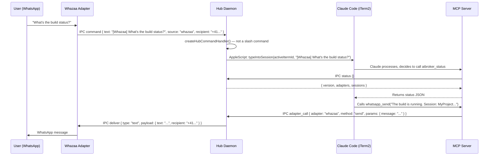
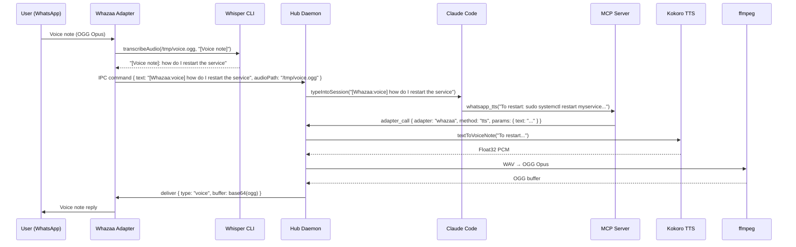
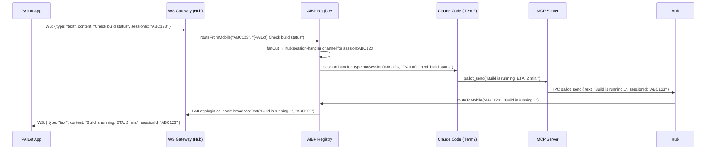
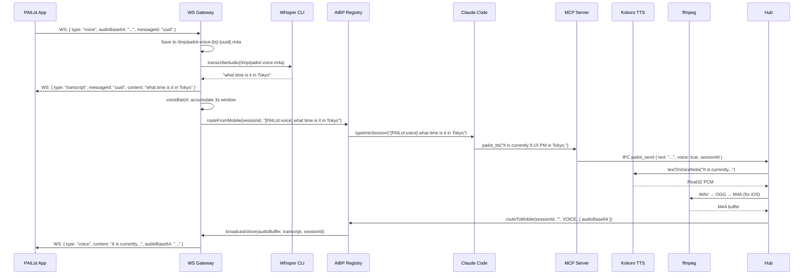
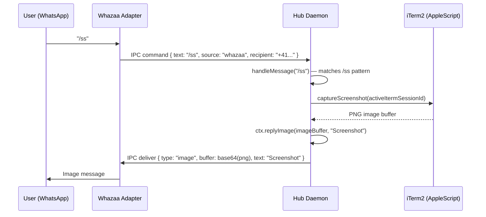
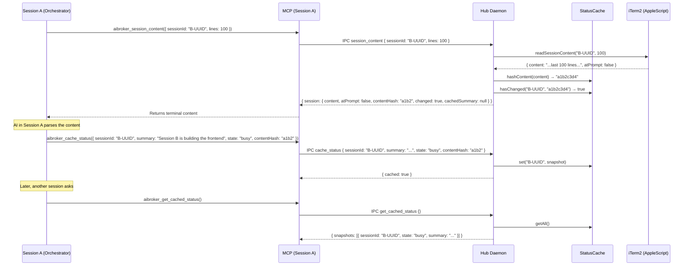
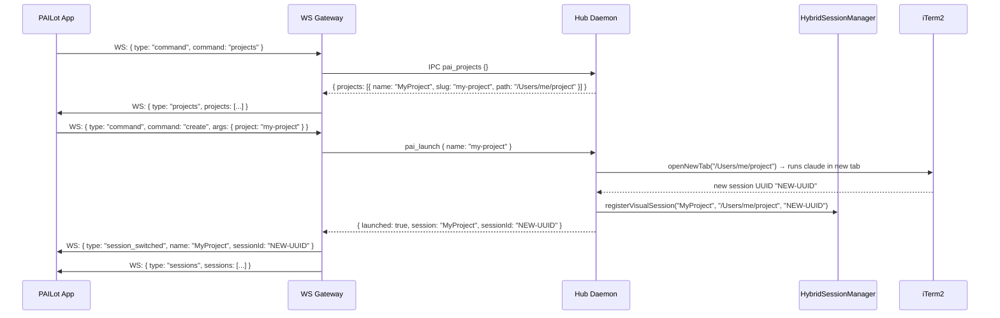
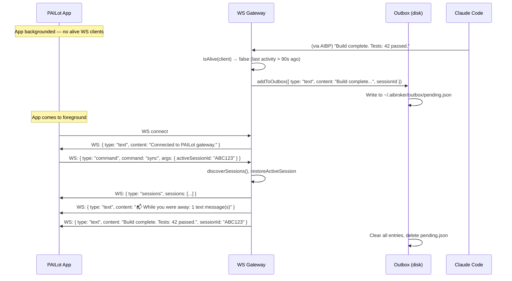
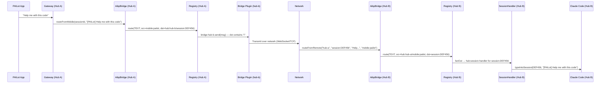
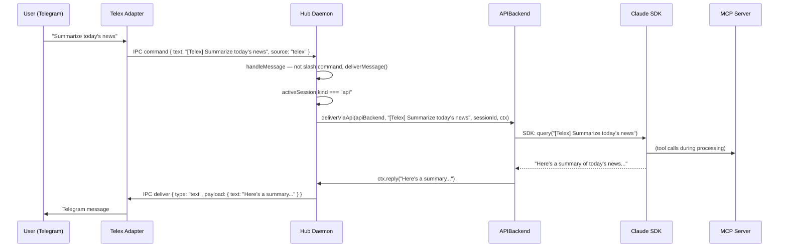

# Use Cases and Message Flow Diagrams

This document traces complete message flows through the AIBroker system for the most common scenarios.

## 1. WhatsApp Text Message → Claude Code Response

A user sends a text message from WhatsApp. The message reaches Claude Code and the response goes back.

**Key points:**
- Whazaa prefixes inbound messages with `[Whazaa]` so Claude knows the source
- Hub delivers to Claude via AppleScript keystroke injection into the active iTerm2 tab
- Claude uses `whatsapp_send` to reply — the MCP routes it back through `adapter_call`
- The `recipient` (phone JID) is threaded through the whole chain

---

## 2. WhatsApp Voice Note → Voice Note Reply

A user sends a voice note. AIBroker transcribes it, delivers to Claude, and sends back a voice reply.

**Key points:**
- Voice transcription happens in the adapter (Whazaa), not the hub
- The `[Whazaa:voice]` prefix signals Claude to reply with `whatsapp_tts` not `whatsapp_send`
- Long responses are chunked (max 500 chars per chunk) and sent as sequential voice notes

---

## 3. PAILot Text Message → Text Reply

A user sends a message from the PAILot iOS app. The hub routes it to Claude, and Claude's reply goes back to the app.

**Key points:**
- PAILot messages flow through the AIBP routing fabric, not through adapter IPC
- The `sessionId` in the WebSocket message routes the reply back to the correct session
- `pailot_send` and `pailot_tts` in the MCP are direct hub calls, not `adapter_call` proxies

---

## 4. PAILot Voice Message → Voice Reply

The user dictates a voice note in the PAILot app. Claude replies with a spoken voice note.

**Key points:**
- The gateway sends a `transcript` message immediately after Whisper finishes so the voice bubble updates in the app
- Voice chunks from multiple utterances within 3 seconds are batched before routing to Claude
- OGG Opus is converted to M4A (AAC) before sending to iOS (iOS cannot play OGG natively)

---

## 5. Slash Command from WhatsApp

The user sends `/ss` from WhatsApp to get a screenshot of the active Claude session.

**Key points:**
- Slash commands are intercepted by `createHubCommandHandler()` before reaching Claude
- The `CommandContext.replyImage()` method is wired to the adapter's `deliver` IPC at dispatch time
- For API sessions, `/ss` returns text status from `APIBackend.formatStatus()` instead of a screenshot

---

## 6. Session Status Check from One Session to Another (Session Orchestration)

Claude Code in session A checks what session B is doing without switching tabs.

**Key points:**
- The hub reads raw terminal content; the requesting AI does the interpretation
- Content hashing (`contentHash`) prevents redundant re-parsing when content hasn't changed
- `changed: false` in the response means use `cachedSummary` directly — no re-parsing needed
- The cache (`StatusCache`) is a daemon-resident singleton shared across all sessions

---

## 7. New Session Creation from PAILot

The user creates a new Claude Code session from the PAILot app.

---

## 8. PAILot Offline Message Buffering

Claude responds while the PAILot app is backgrounded. Messages are buffered and delivered when the app reconnects.

**Key points:**
- Liveness threshold: `CLIENT_ALIVE_THRESHOLD=90000ms` (90 seconds)
- Typing messages are never buffered; image messages are counted but not stored
- Max outbox size: `MAX_OUTBOX_PER_SESSION=50` messages
- The outbox summary (`📬 While you were away: ...`) is sent first, then all buffered messages in timestamp order

---

## 9. Cross-Hub Mesh Message (PAILot on Hub A → Claude on Hub B)

The user is on a mobile device connected to Hub A (local Mac), sending messages to a Claude session running on Hub B (remote Mac).

**Key points:**
- Mesh addresses contain `/`: `hub:hub-b/session:DEF456`
- `isLocal()` returns `false` for any address with `/` — triggers `routeToMesh()`
- The bridge plugin's `sendFn` is transport-specific (WebSocket, TCP) — not implemented yet
- `src` is prefixed with the remote hub ID on receipt: `hub:hub-a/mobile:pailot`

See [mesh.md](./mesh.md) for the complete mesh networking documentation.

---

## 10. Telegram Text Message → API Session Response

The user sends a Telegram message that routes to a headless Claude API session (no iTerm2 tab).

**Key points:**
- API sessions use the Claude Agent SDK directly — no iTerm2, no AppleScript
- `deliverViaApi()` handles the conversation turn and delivers responses through `CommandContext`
- The `claudeSessionId` from the SDK is saved to `sessions.json` for conversation resume across daemon restarts
- `APIBackend.formatStatus()` returns text for `/ss` instead of triggering a screenshot
