# Use Cases and Message Flow Diagrams

This document traces complete message flows through the AIBroker system for the most common scenarios.

## 1. WhatsApp Text Message → Claude Code Response

A user sends a text message from WhatsApp. The message reaches Claude Code and the response goes back.

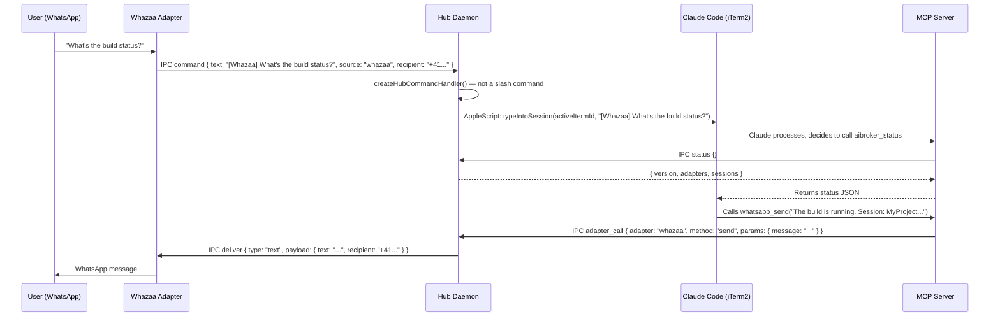
```mermaid
sequenceDiagram
    participant User as User (WhatsApp)
    participant WA as Whazaa Adapter
    participant Hub as Hub Daemon
    participant CC as Claude Code (iTerm2)
    participant MCP as MCP Server

    User->>WA: "What's the build status?"
    WA->>Hub: IPC command { text: "[Whazaa] What's the build status?", source: "whazaa", recipient: "+41..." }
    Hub->>Hub: createHubCommandHandler() — not a slash command
    Hub->>CC: AppleScript: typeIntoSession(activeItermId, "[Whazaa] What's the build status?")
    CC->>MCP: Claude processes, decides to call aibroker_status
    MCP->>Hub: IPC status {}
    Hub-->>MCP: { version, adapters, sessions }
    MCP-->>CC: Returns status JSON
    CC->>MCP: Calls whatsapp_send("The build is running. Session: MyProject...")
    MCP->>Hub: IPC adapter_call { adapter: "whazaa", method: "send", params: { message: "..." } }
    Hub->>WA: IPC deliver { type: "text", payload: { text: "...", recipient: "+41..." } }
    WA->>User: WhatsApp message
```

**Key points:**
- Whazaa prefixes inbound messages with `[Whazaa]` so Claude knows the source
- Hub delivers to Claude via AppleScript keystroke injection into the active iTerm2 tab
- Claude uses `whatsapp_send` to reply — the MCP routes it back through `adapter_call`
- The `recipient` (phone JID) is threaded through the whole chain

---

## 2. WhatsApp Voice Note → Voice Note Reply

A user sends a voice note. AIBroker transcribes it, delivers to Claude, and sends back a voice reply.

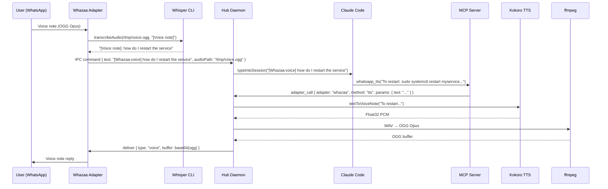
```mermaid
sequenceDiagram
    participant User as User (WhatsApp)
    participant WA as Whazaa Adapter
    participant Whisper as Whisper CLI
    participant Hub as Hub Daemon
    participant CC as Claude Code
    participant MCP as MCP Server
    participant Kokoro as Kokoro TTS
    participant FFMPEG as ffmpeg

    User->>WA: Voice note (OGG Opus)
    WA->>Whisper: transcribeAudio(/tmp/voice.ogg, "[Voice note]")
    Whisper-->>WA: "[Voice note]: how do I restart the service"
    WA->>Hub: IPC command { text: "[Whazaa:voice] how do I restart the service", audioPath: "/tmp/voice.ogg" }
    Hub->>CC: typeIntoSession("[Whazaa:voice] how do I restart the service")
    CC->>MCP: whatsapp_tts("To restart: sudo systemctl restart myservice...")
    MCP->>Hub: adapter_call { adapter: "whazaa", method: "tts", params: { text: "..." } }
    Hub->>Kokoro: textToVoiceNote("To restart...")
    Kokoro-->>Hub: Float32 PCM
    Hub->>FFMPEG: WAV → OGG Opus
    FFMPEG-->>Hub: OGG buffer
    Hub->>WA: deliver { type: "voice", buffer: base64(ogg) }
    WA->>User: Voice note reply
```

**Key points:**
- Voice transcription happens in the adapter (Whazaa), not the hub
- The `[Whazaa:voice]` prefix signals Claude to reply with `whatsapp_tts` not `whatsapp_send`
- Long responses are chunked (max 500 chars per chunk) and sent as sequential voice notes

---

## 3. PAILot Text Message → Text Reply

A user sends a message from the PAILot iOS app. The hub routes it to Claude, and Claude's reply goes back to the app.

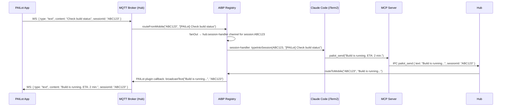
```mermaid
sequenceDiagram
    participant App as PAILot App
    participant GW as MQTT Broker (Hub)
    participant AIBP as AIBP Registry
    participant CC as Claude Code (iTerm2)
    participant MCP as MCP Server

    App->>GW: WS: { type: "text", content: "Check build status", sessionId: "ABC123" }
    GW->>AIBP: routeFromMobile("ABC123", "[PAILot] Check build status")
    AIBP->>AIBP: fanOut → hub:session-handler channel for session:ABC123
    AIBP->>CC: session-handler: typeIntoSession(ABC123, "[PAILot] Check build status")
    CC->>MCP: pailot_send("Build is running. ETA: 2 min.")
    MCP->>Hub: IPC pailot_send { text: "Build is running...", sessionId: "ABC123" }
    Hub->>AIBP: routeToMobile("ABC123", "Build is running...")
    AIBP->>GW: PAILot plugin callback: broadcastText("Build is running...", "ABC123")
    GW->>App: WS: { type: "text", content: "Build is running. ETA: 2 min.", sessionId: "ABC123" }
```

**Key points:**
- PAILot messages flow through the AIBP routing fabric, not through adapter IPC
- The `sessionId` in the payload routes the reply back to the correct session
- `pailot_send` and `pailot_tts` in the MCP are direct hub calls, not `adapter_call` proxies

---

## 4. PAILot Voice Message → Voice Reply

The user dictates a voice note in the PAILot app. Claude replies with a spoken voice note.

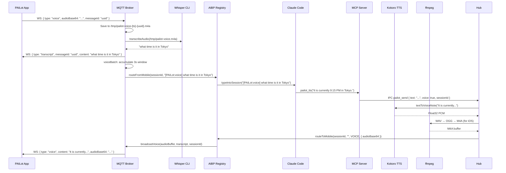
```mermaid
sequenceDiagram
    participant App as PAILot App
    participant GW as MQTT Broker
    participant Whisper as Whisper CLI
    participant AIBP as AIBP Registry
    participant CC as Claude Code
    participant MCP as MCP Server
    participant Kokoro as Kokoro TTS
    participant FFMPEG as ffmpeg

    App->>GW: WS: { type: "voice", audioBase64: "...", messageId: "uuid" }
    GW->>GW: Save to /tmp/pailot-voice-{ts}-{uuid}.m4a
    GW->>Whisper: transcribeAudio(/tmp/pailot-voice.m4a)
    Whisper-->>GW: "what time is it in Tokyo"
    GW->>App: WS: { type: "transcript", messageId: "uuid", content: "what time is it in Tokyo" }
    GW->>GW: voiceBatch: accumulate 3s window
    GW->>AIBP: routeFromMobile(sessionId, "[PAILot:voice] what time is it in Tokyo")
    AIBP->>CC: typeIntoSession("[PAILot:voice] what time is it in Tokyo")
    CC->>MCP: pailot_tts("It is currently 9:15 PM in Tokyo.")
    MCP->>Hub: IPC pailot_send { text: "...", voice: true, sessionId }
    Hub->>Kokoro: textToVoiceNote("It is currently...")
    Kokoro-->>Hub: Float32 PCM
    Hub->>FFMPEG: WAV → OGG → M4A (for iOS)
    FFMPEG-->>Hub: M4A buffer
    Hub->>AIBP: routeToMobile(sessionId, "", VOICE, { audioBase64 })
    AIBP->>GW: broadcastVoice(audioBuffer, transcript, sessionId)
    GW->>App: WS: { type: "voice", content: "It is currently...", audioBase64: "..." }
```

**Key points:**
- The gateway sends a `transcript` message immediately after Whisper finishes so the voice bubble updates in the app
- Voice chunks from multiple utterances within 3 seconds are batched before routing to Claude
- OGG Opus is converted to M4A (AAC) before sending to iOS (iOS cannot play OGG natively)

---

## 5. Slash Command from WhatsApp

The user sends `/ss` from WhatsApp to get a screenshot of the active Claude session.

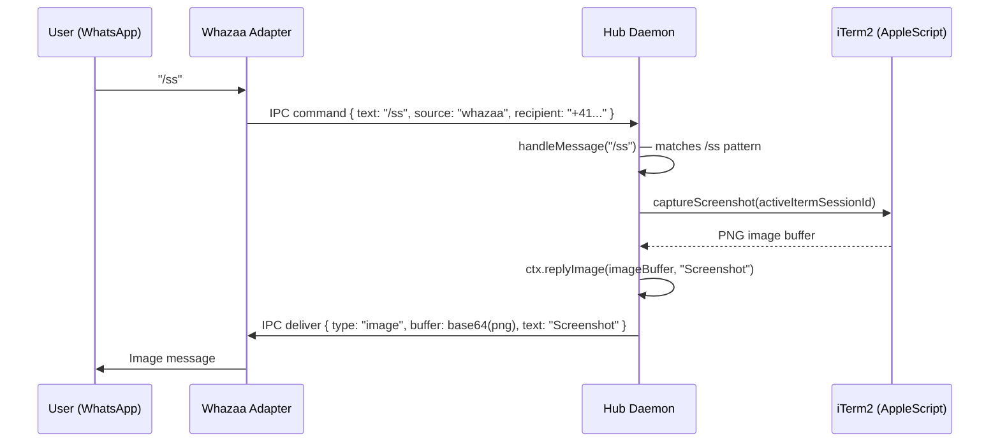
```mermaid
sequenceDiagram
    participant User as User (WhatsApp)
    participant WA as Whazaa Adapter
    participant Hub as Hub Daemon
    participant iTerm as iTerm2 (AppleScript)

    User->>WA: "/ss"
    WA->>Hub: IPC command { text: "/ss", source: "whazaa", recipient: "+41..." }
    Hub->>Hub: handleMessage("/ss") — matches /ss pattern
    Hub->>iTerm: captureScreenshot(activeItermSessionId)
    iTerm-->>Hub: PNG image buffer
    Hub->>Hub: ctx.replyImage(imageBuffer, "Screenshot")
    Hub->>WA: IPC deliver { type: "image", buffer: base64(png), text: "Screenshot" }
    WA->>User: Image message
```

**Key points:**
- Slash commands are intercepted by `createHubCommandHandler()` before reaching Claude
- The `CommandContext.replyImage()` method is wired to the adapter's `deliver` IPC at dispatch time
- For API sessions, `/ss` returns text status from `APIBackend.formatStatus()` instead of a screenshot

---

## 6. Session Status Check from One Session to Another (Session Orchestration)

Claude Code in session A checks what session B is doing without switching tabs.

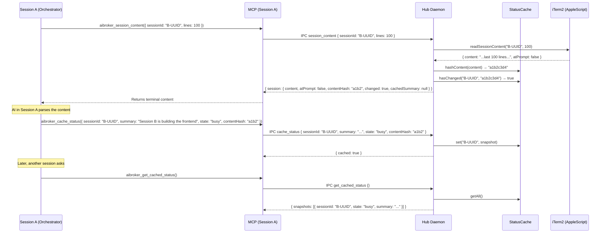
```mermaid
sequenceDiagram
    participant A as Session A (Orchestrator)
    participant MCP_A as MCP (Session A)
    participant Hub as Hub Daemon
    participant Cache as StatusCache
    participant iTerm as iTerm2 (AppleScript)

    A->>MCP_A: aibroker_session_content({ sessionId: "B-UUID", lines: 100 })
    MCP_A->>Hub: IPC session_content { sessionId: "B-UUID", lines: 100 }
    Hub->>iTerm: readSessionContent("B-UUID", 100)
    iTerm-->>Hub: { content: "...last 100 lines...", atPrompt: false }
    Hub->>Cache: hashContent(content) → "a1b2c3d4"
    Hub->>Cache: hasChanged("B-UUID", "a1b2c3d4") → true
    Hub-->>MCP_A: { session: { content, atPrompt: false, contentHash: "a1b2", changed: true, cachedSummary: null } }
    MCP_A-->>A: Returns terminal content

    Note over A: AI in Session A parses the content
    A->>MCP_A: aibroker_cache_status({ sessionId: "B-UUID", summary: "Session B is building the frontend", state: "busy", contentHash: "a1b2" })
    MCP_A->>Hub: IPC cache_status { sessionId: "B-UUID", summary: "...", state: "busy", contentHash: "a1b2" }
    Hub->>Cache: set("B-UUID", snapshot)
    Hub-->>MCP_A: { cached: true }

    Note over A: Later, another session asks
    A->>MCP_A: aibroker_get_cached_status()
    MCP_A->>Hub: IPC get_cached_status {}
    Hub->>Cache: getAll()
    Hub-->>MCP_A: { snapshots: [{ sessionId: "B-UUID", state: "busy", summary: "..." }] }
```

**Key points:**
- The hub reads raw terminal content; the requesting AI does the interpretation
- Content hashing (`contentHash`) prevents redundant re-parsing when content hasn't changed
- `changed: false` in the response means use `cachedSummary` directly — no re-parsing needed
- The cache (`StatusCache`) is a daemon-resident singleton shared across all sessions

---

## 7. New Session Creation from PAILot

The user creates a new Claude Code session from the PAILot app.

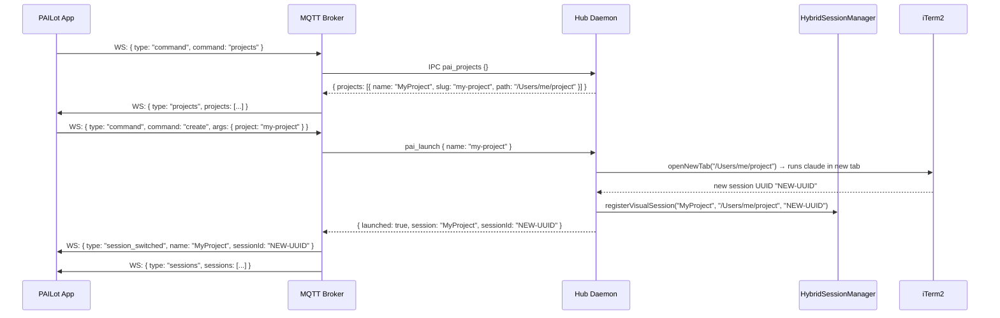
```mermaid
sequenceDiagram
    participant App as PAILot App
    participant GW as MQTT Broker
    participant Hub as Hub Daemon
    participant HybMgr as HybridSessionManager
    participant iTerm as iTerm2

    App->>GW: WS: { type: "command", command: "projects" }
    GW->>Hub: IPC pai_projects {}
    Hub-->>GW: { projects: [{ name: "MyProject", slug: "my-project", path: "/Users/me/project" }] }
    GW->>App: WS: { type: "projects", projects: [...] }

    App->>GW: WS: { type: "command", command: "create", args: { project: "my-project" } }
    GW->>Hub: pai_launch { name: "my-project" }
    Hub->>iTerm: openNewTab("/Users/me/project") → runs claude in new tab
    iTerm-->>Hub: new session UUID "NEW-UUID"
    Hub->>HybMgr: registerVisualSession("MyProject", "/Users/me/project", "NEW-UUID")
    Hub-->>GW: { launched: true, session: "MyProject", sessionId: "NEW-UUID" }
    GW->>App: WS: { type: "session_switched", name: "MyProject", sessionId: "NEW-UUID" }
    GW->>App: WS: { type: "sessions", sessions: [...] }
```

---

## 8. PAILot Offline Message Buffering

Claude responds while the PAILot app is backgrounded. Messages are buffered and delivered when the app reconnects.

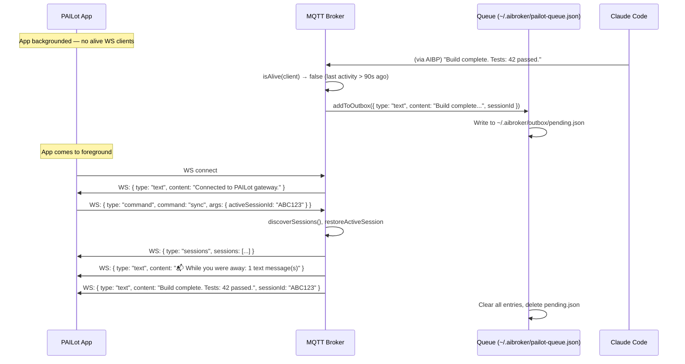
```mermaid
sequenceDiagram
    participant App as PAILot App
    participant GW as MQTT Broker
    participant Q as Queue (~/.aibroker/pailot-queue.json)
    participant CC as Claude Code

    Note over App: App backgrounded — no alive WS clients

    CC->>GW: (via AIBP) "Build complete. Tests: 42 passed."
    GW->>GW: isAlive(client) → false (last activity > 90s ago)
    GW->>Q: addToOutbox({ type: "text", content: "Build complete...", sessionId })
    Q->>Q: Write to ~/.aibroker/outbox/pending.json

    Note over App: App comes to foreground

    App->>GW: WS connect
    GW->>App: WS: { type: "text", content: "Connected to PAILot gateway." }
    App->>GW: WS: { type: "command", command: "sync", args: { activeSessionId: "ABC123" } }
    GW->>GW: discoverSessions(), restoreActiveSession
    GW->>App: WS: { type: "sessions", sessions: [...] }
    GW->>App: WS: { type: "text", content: "📬 While you were away: 1 text message(s)" }
    GW->>App: WS: { type: "text", content: "Build complete. Tests: 42 passed.", sessionId: "ABC123" }
    Q->>Q: Clear all entries, delete pending.json
```

**Key points:**
- Liveness threshold: `CLIENT_ALIVE_THRESHOLD=90000ms` (90 seconds)
- Typing messages are never buffered; image messages are counted but not stored
- Max outbox size: `MAX_OUTBOX_PER_SESSION=50` messages
- The outbox summary (`📬 While you were away: ...`) is sent first, then all buffered messages in timestamp order

---

## 9. Cross-Hub Mesh Message (PAILot on Hub A → Claude on Hub B)

The user is on a mobile device connected to Hub A (local Mac), sending messages to a Claude session running on Hub B (remote Mac).

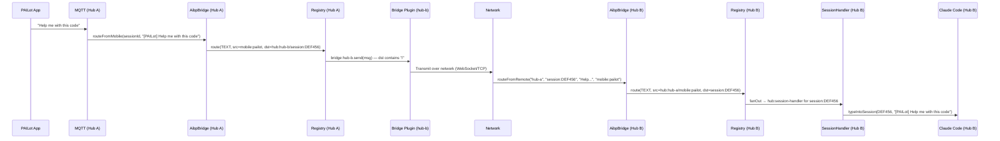
```mermaid
sequenceDiagram
    participant App as PAILot App
    participant GA as MQTT (Hub A)
    participant BA as AibpBridge (Hub A)
    participant RA as Registry (Hub A)
    participant Bridge as Bridge Plugin (hub-b)
    participant NET as Network
    participant BB as AibpBridge (Hub B)
    participant RB as Registry (Hub B)
    participant H as SessionHandler (Hub B)
    participant CC as Claude Code (Hub B)

    App->>GA: "Help me with this code"
    GA->>BA: routeFromMobile(sessionId, "[PAILot] Help me with this code")
    BA->>RA: route(TEXT, src=mobile:pailot, dst=hub:hub-b/session:DEF456)
    RA->>Bridge: bridge:hub-b.send(msg) — dst contains "/"
    Bridge->>NET: Transmit over network (WebSocket/TCP)
    NET->>BB: routeFromRemote("hub-a", "session:DEF456", "Help...", "mobile:pailot")
    BB->>RB: route(TEXT, src=hub:hub-a/mobile:pailot, dst=session:DEF456)
    RB->>H: fanOut → hub:session-handler for session:DEF456
    H->>CC: typeIntoSession(DEF456, "[PAILot] Help me with this code")
```

**Key points:**
- Mesh addresses contain `/`: `hub:hub-b/session:DEF456`
- `isLocal()` returns `false` for any address with `/` — triggers `routeToMesh()`
- The bridge plugin's `sendFn` is transport-specific (WebSocket, TCP) — not implemented yet
- `src` is prefixed with the remote hub ID on receipt: `hub:hub-a/mobile:pailot`

See [mesh.md](./mesh.md) for the complete mesh networking documentation.

---

## 10. Telegram Text Message → API Session Response

The user sends a Telegram message that routes to a headless Claude API session (no iTerm2 tab).

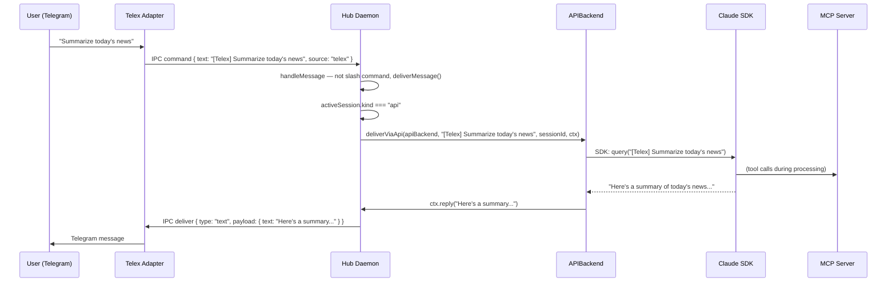
```mermaid
sequenceDiagram
    participant User as User (Telegram)
    participant TG as Telex Adapter
    participant Hub as Hub Daemon
    participant API as APIBackend
    participant Claude as Claude SDK
    participant MCP as MCP Server

    User->>TG: "Summarize today's news"
    TG->>Hub: IPC command { text: "[Telex] Summarize today's news", source: "telex" }
    Hub->>Hub: handleMessage — not slash command, deliverMessage()
    Hub->>Hub: activeSession.kind === "api"
    Hub->>API: deliverViaApi(apiBackend, "[Telex] Summarize today's news", sessionId, ctx)
    API->>Claude: SDK: query("[Telex] Summarize today's news")
    Claude->>MCP: (tool calls during processing)
    Claude-->>API: "Here's a summary of today's news..."
    API->>Hub: ctx.reply("Here's a summary...")
    Hub->>TG: IPC deliver { type: "text", payload: { text: "Here's a summary..." } }
    TG->>User: Telegram message
```

**Key points:**
- API sessions use the Claude Agent SDK directly — no iTerm2, no AppleScript
- `deliverViaApi()` handles the conversation turn and delivers responses through `CommandContext`
- The `claudeSessionId` from the SDK is saved to `sessions.json` for conversation resume across daemon restarts
- `APIBackend.formatStatus()` returns text for `/ss` instead of triggering a screenshot

---

## 11. Todoist task filed from a phone → a session executes it

The channel that turns a task typed on a watch into work done on the Mac.

```mermaid
sequenceDiagram
    participant U as You (phone / watch)
    participant TD as Todoist
    participant WH as Webhook receiver (:8766)
    participant IN as Ingress grants
    participant D as Dispatch
    participant CC as Claude Code session

    U->>TD: File a task in "Claude 🤖 / AIBroker"
    TD->>WH: POST /todoist  (item:added, HMAC-signed)
    WH->>WH: Verify signature; reject unsigned
    WH->>IN: Is this project granted? Who owns it?
    IN-->>WH: owner = aibroker
    WH->>D: submitAndConfirm(session, "[Task] …")
    D->>CC: Type into the prompt, watch it leave the input line
    CC-->>D: confirmed
    D->>WH: audit: delivered
    Note over CC: Session acts, then answers with todoist_reply
```

**Why each guard exists.** The signature check is the security boundary — Todoist
documents that the initiator "may be a collaborator from a shared project", so an
unsigned or unverified request is a stranger with a path to your machine. The
ingress grant is the second: a task only becomes an instruction if its project
was explicitly granted. Both refusals are audited; silence would be
indistinguishable from nothing having been sent.

See [todoist.md](./todoist.md) and [channels.md](./channels.md).

---

## 12. An external system raises an event → a session hears about it

The generic door. Anything that speaks HTTP, without writing an adapter.

```mermaid
sequenceDiagram
    participant SRC as External source (server, app, platform)
    participant HK as /hook/&lt;route&gt; (:8766)
    participant RT as Route table
    participant MB as Session mailbox
    participant CC as Claude Code session

    SRC->>HK: POST + x-aibroker-token
    HK->>RT: Known route? Secret correct? Under rate limit?
    Note over HK,RT: Unknown route and wrong secret<br/>both answer 404 — no enumeration
    RT-->>HK: route → owner session, mode
    HK-->>SRC: 202 accepted (before delivery, so a slow<br/>delivery is never retried into a duplicate)
    alt mode = task
        HK->>CC: File a Todoist task; a human sees it first
    else mode = message
        HK->>MB: Deposit, then type into the session
        MB->>CC: Drained on the next prompt if the session was busy
    end
    HK->>HK: audit: delivered / refused, with the reason
```

**The route names the session; the payload never does.** If a caller could choose
the target, whoever holds the URL would choose which session runs with your
rights. Name routes after their **source** (`monster`, `glidr`), not a topic —
a topic name smuggles a classification decision into the transport layer.

See [inbound.md](./inbound.md).

---

## 13. A session answers a task → the answer becomes findable

Todoist never notifies an account about its own activity, and the bridge writes
as the account owner. Without this path, a reply lands invisibly on one task in
a tree of hundreds.

```mermaid
sequenceDiagram
    participant CC as Claude Code session
    participant TR as todoist_reply
    participant TD as Todoist
    participant MR as Comment mirror
    participant MP as 📬 Comments project
    participant U as You

    CC->>TR: Answer on task 6hCG…
    TR->>TD: POST comment (prefixed 🤖)
    TR->>MR: mirrorComment(taskId, text)
    Note over MR: Direct — no polling. We wrote it,<br/>so nothing needs rediscovering.
    MR->>MP: Ensure section named after the source project
    MR->>MP: Task = 💬 title, excerpt + link; full text as a marked comment
    U->>MP: Reads it there, replies on the mirror entry
    MP->>MR: note:added (unmarked = the human's)
    MR->>TD: Carry the comment back to the real task
    TD->>CC: Arrives as [Task:comment]
```

**Marks are the loop guard.** Agent-written comments carry `🤖` and are ignored on
the way in. The mirror's own copy of the reply is marked for exactly this reason:
unmarked, the carry-back path reads it as the human's and posts a verbatim
duplicate onto the conversation it came from.

**Failures queue rather than drop.** A mirror write that fails is retried on the
next reply, so removing the poll did not reintroduce silent loss.

---

## 14. One session hands work to another

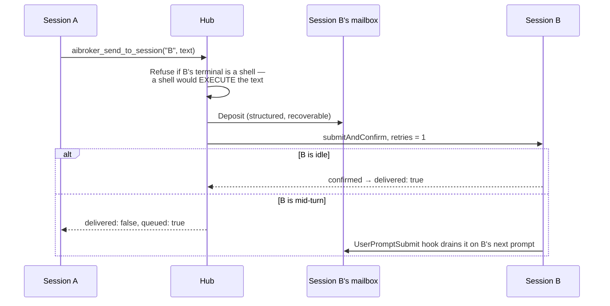
```mermaid
sequenceDiagram
    participant A as Session A
    participant HUB as Hub
    participant MB as Session B's mailbox
    participant B as Session B

    A->>HUB: aibroker_send_to_session("B", text)
    HUB->>HUB: Refuse if B's terminal is a shell —<br/>a shell would EXECUTE the text
    HUB->>MB: Deposit (structured, recoverable)
    HUB->>B: submitAndConfirm, retries = 1
    alt B is idle
        B-->>HUB: confirmed → delivered: true
    else B is mid-turn
        HUB-->>A: delivered: false, queued: true
        B->>MB: UserPromptSubmit hook drains it on B's next prompt
    end
```

**`ok: true` is not "they have seen it".** The typed copy is best-effort; the
mailbox is the durable path. Thirty-five real messages sat undrained across five
sessions before the drain hook existed, the oldest for a day.

**Retries default to 1.** A redelivered message is a duplicate nobody downstream
can distinguish from two real events — one message was once delivered three
times for exactly this reason.
